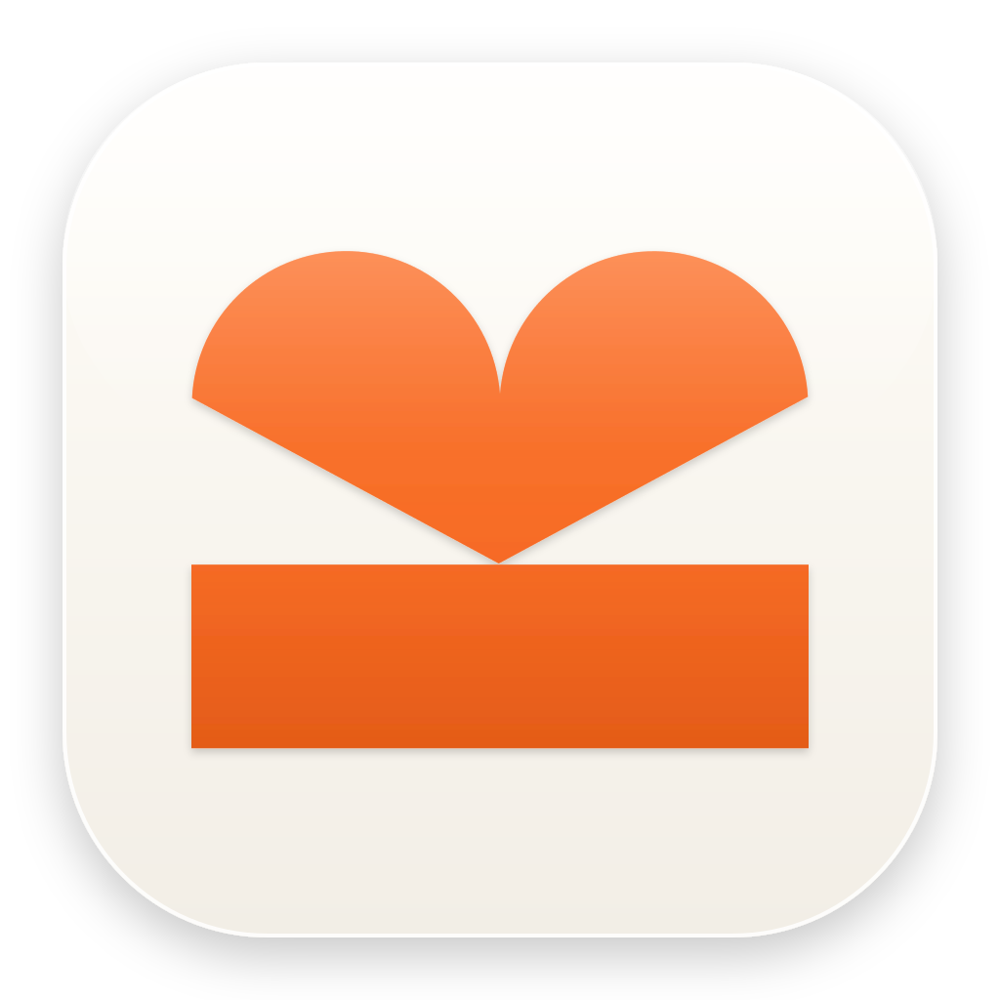

<div align="center">



# MemryNote

### The second brain that lives on your machine — not someone else's cloud.

Notes, tasks, projects, journal, calendar, and an AI agent that actually knows your work.
All on your disk. End-to-end encrypted. Every feature a toggle.

[Download](https://github.com/memrynote/memry/releases/latest) · [Website](https://memrynote.com) · [Docs](https://docs.memrynote.com)

[](https://github.com/memrynote/memry/releases)
[](https://github.com/memrynote/memry/releases)
[](https://codecov.io/gh/memrynote/memry)
[](LICENSE)

</div>

<div align="center">

**Most note apps are a SaaS wearing a text editor. MemryNote is the opposite bet.**

</div>


## Install

**macOS (Homebrew)**

```sh
brew install --cask memrynote/tap/memry
```

**macOS · Windows · Linux** — grab the installer from the [latest release](https://github.com/memrynote/memry/releases/latest).

That's it. Open it, point it at a folder, and your vault is yours.

## What's inside

Seven surfaces, one app. Turn off anything you don't use.

- **Notes** — Block editor, markdown on disk, backlinks, tags, instant search.
- **Tasks & Projects** — Due dates, priorities, recurrence. CRDT merge, so two devices never clobber each other.
- **Journal** — One file a day. Open in three keystrokes.
- **Calendar** — Time-block your tasks. Drag to reschedule.
- **Canvas** — Infinite board. Draw freehand, then drop real notes, tasks, and events on it as live cards — never copies.
- **Inbox** — Capture now, sort later.
- **AI Agent** — Bring your own model (Claude, Codex, local LLMs). It reads and writes your vault — with an approval step for every write.
- **Sync** — Optional, end-to-end encrypted, multi-device. The server only ever sees ciphertext.

## Why it stays yours

- **Local-first.** Your vault is files on disk. Works offline. Always.
- **End-to-end encrypted.** XChaCha20-Poly1305 + Ed25519 + Argon2id. Sign out and it's unreadable to anyone but you — including us.
- **Agent-native.** The agent reaches your vault through a localhost MCP server. No third-party sees your notes.
- **Yours to leave.** Markdown on disk means you can walk out the door with your data any time.

## A note from me

I'm [Kaan](https://x.com/h4yfans). For years I bounced between four apps just to get through a day — and with ADHD, that jumping drained me before I'd started. I wanted one calm place that held all of it _and_ an agent that already knew my work. Nothing did it without renting my brain back to me from a server I didn't control. So I built MemryNote. It's the app I wish I'd had.

## Build from source

Want to run it locally, hack on it, or contribute? See **[docs/DEVELOPMENT.md](docs/DEVELOPMENT.md)**.

## Roadmap

https://memrynote.com/roadmap

## Support

MemryNote is free and stays free. Sync is the only paid part, and nothing here unlocks a feature. If the app saves you time and you want to chip in, sponsoring covers certificates, servers, and developer fees.

[](https://github.com/sponsors/h4yfans)

## Community

[r/memrynote](https://www.reddit.com/r/memrynote/) · [@X](https://twitter.com/h4yfans) · [Issues](https://github.com/memrynote/memry/issues) · kaan@memrynote.com

Ship a workflow you love? Tell us. Something broken? Tell us louder.

---

<div align="center">

## Star History

<a href="https://www.star-history.com/?repos=memrynote%2Fmemry&type=date&legend=top-left">
 <picture>
   <source media="(prefers-color-scheme: light)" srcset="https://api.star-history.com/chart?repos=memrynote/memry&type=date&legend=top-left&sealed_token=RfnW2HzoduF_QqJlXo5Aep12pgXEoYiDWc2DnlQEvG7qwKXw2WG8YIVrEDs9BP7Oii0_rc7baIChuEb6_O6nkS2eyzxCm_JcvyQ-aZgxkZkcEhCzDGG64KSAcEw9AR8B8BrgOhS9LEtLPa2Lcgnz62EvG6Sw4hwrv8zaQDW8OhZ-Si5a1-K_u4YCYWxM" />
   
 </picture>
</a>
<sub>

AGPL-3.0 © MemryNote contributors — private by design, open at heart.</sub>

</div>
