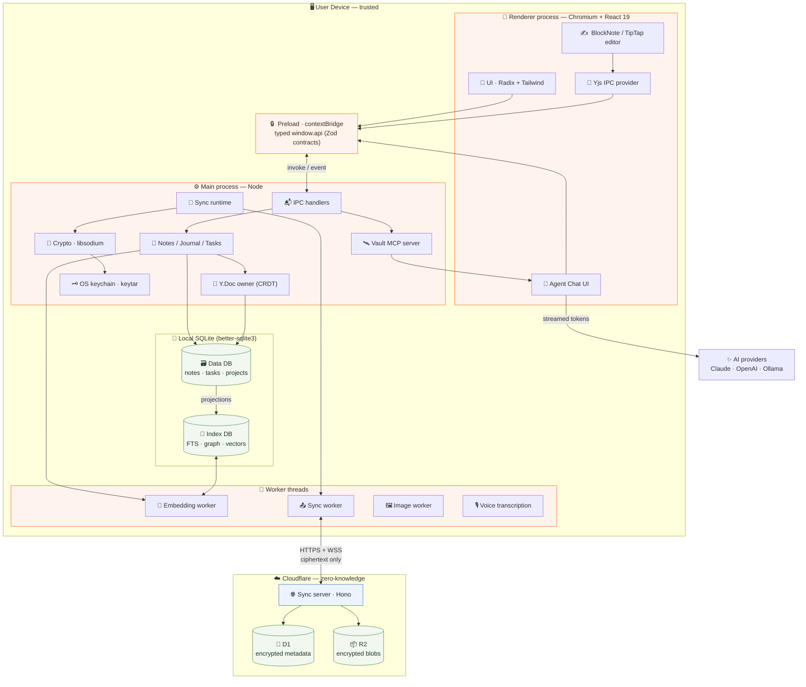
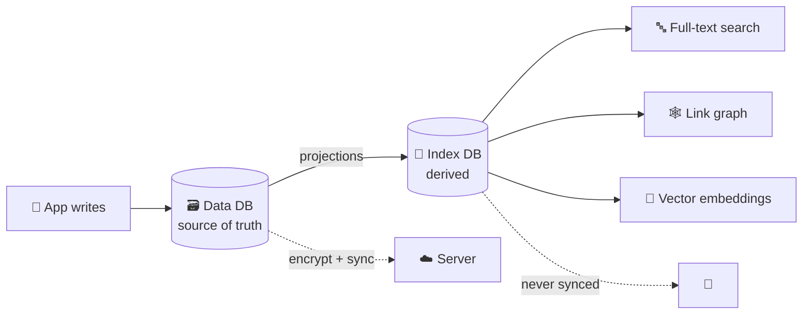
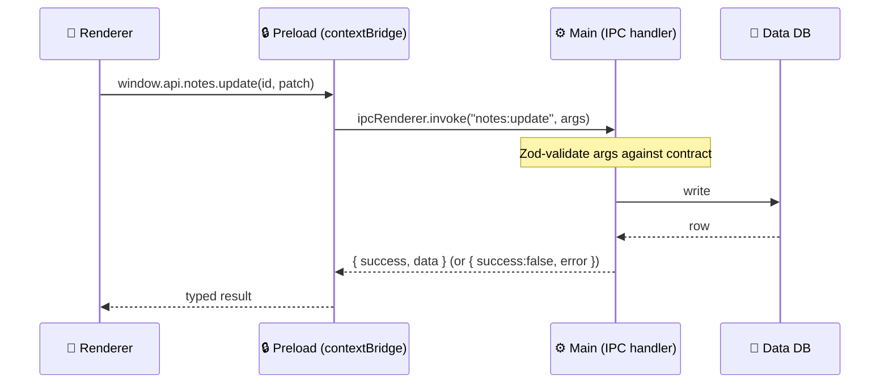
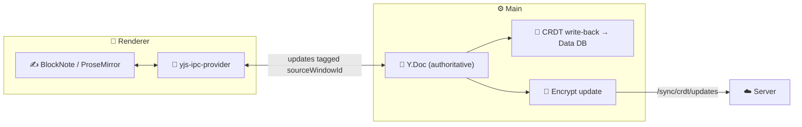
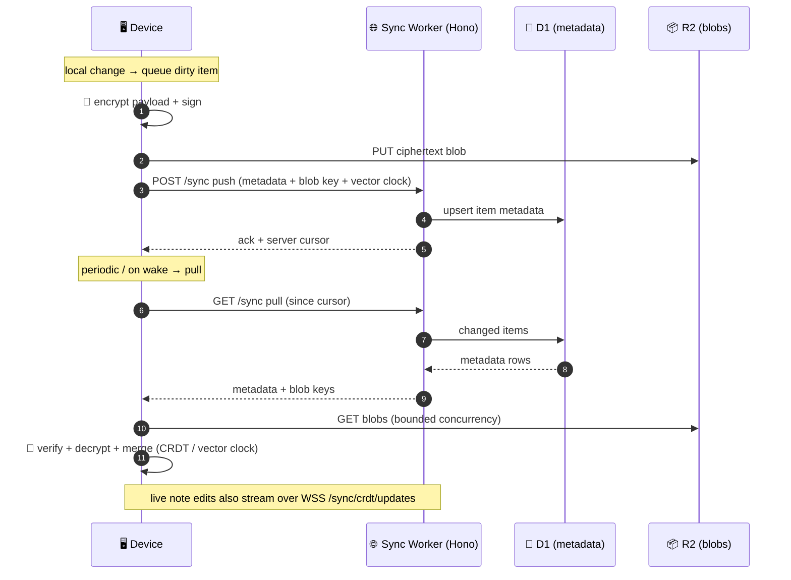
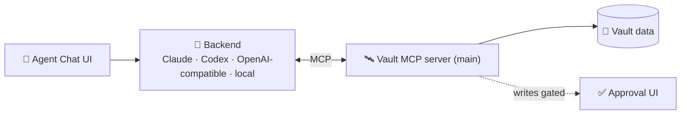

# MemryNote Desktop — Architecture

> Engineering reference for the Electron desktop app (`apps/desktop`).
> For the browsable version see the docs site under `apps/docs/src/architecture/`.

MemryNote is a **local-first, end-to-end encrypted** notes / journal / tasks app.
Your data lives on your device in plaintext SQLite; anything that leaves the
device is encrypted client-side. The sync server stores and serves **ciphertext
only** — it never holds a key and never sees a byte of plaintext.

- **Platform**: Electron 39 (Chromium + Node), three-process model.
- **UI**: React 19 + Vite + Tailwind v4.
- **Storage**: two local SQLite databases (data + search/index) via Drizzle ORM.
- **Sync**: hybrid — bulk encrypted snapshots + incremental Yjs CRDT updates.
- **Crypto**: XChaCha20-Poly1305 + Ed25519 + Argon2id via libsodium.
- **Backend**: Cloudflare Workers + Hono, D1 (metadata) + R2 (blobs).

---

## Table of contents

1. [System overview](#system-overview)
2. [Architecture diagram](#architecture-diagram)
3. [Process model](#process-model)
4. [Tech stack](#tech-stack)
5. [Monorepo layout](#monorepo-layout)
6. [Local storage — dual SQLite](#local-storage--dual-sqlite)
7. [IPC boundary](#ipc-boundary)
8. [Editor & CRDT collaboration](#editor--crdt-collaboration)
9. [Sync architecture](#sync-architecture)
10. [Cryptography & trust boundary](#cryptography--trust-boundary)
11. [Agent Chat & MCP](#agent-chat--mcp)
12. [Background workers](#background-workers)
13. [Build, package & update](#build-package--update)
14. [Verification gates](#verification-gates)

---

## System overview

The desktop app is the product; the server is dumb encrypted storage.

Every user action — typing a note, checking a task, capturing a link — writes
first to the **local SQLite data DB** and renders instantly from there. The app
is fully usable offline. A background **sync runtime** later encrypts those
changes, uploads metadata to **Cloudflare D1** and payload blobs to **R2**, and
pulls remote changes back down, decrypting them locally.

Two conflict-resolution strategies run side by side:

- **Notes & journals** use **Yjs CRDTs** — character-level merge, no conflicts,
  incremental updates over WebSocket.
- **Tasks & projects** use **field-level vector clocks** — per-field
  last-writer-wins with causality tracking.

A second **index DB** mirrors content into full-text search, a link graph, and
vector embeddings for semantic search — kept fresh by projections off the data
DB, never synced (it is derivable and device-local).

The **main process** is the trust anchor: it owns the databases, the encryption
keys (sealed in the OS keychain via keytar), the CRDT documents, and every
network call. The **renderer** (React) holds no secrets and talks to main only
through a typed, Zod-validated IPC contract.

---

## Architecture diagram



**Read it as:** everything inside `🖥️ User Device` is trusted and works
offline. The only thing crossing into `☁️ Cloudflare` is ciphertext, via the
sync worker over HTTPS + secure WebSocket. AI providers see only what the user
sends in an Agent Chat turn.

---

## Process model

Electron splits the app into isolated processes. `electron-vite` builds each
target separately (`electron.vite.config.ts`).

| Process      | Runtime             | Owns                                                                    | Trust              |
| ------------ | ------------------- | ----------------------------------------------------------------------- | ------------------ |
| **Main**     | Node                | DBs, crypto keys, Y.Docs, sync, network, window/menu lifecycle          | Trust anchor       |
| **Preload**  | Isolated bridge     | `contextBridge` — exposes a typed, narrow `window.api`                  | Boundary guard     |
| **Renderer** | Chromium (React)    | UI only. No keys, no direct DB, no raw Node                             | Untrusted for data |
| **Workers**  | Node worker threads | CPU-heavy jobs off the main thread (see [Workers](#background-workers)) | Main-spawned       |

Key rules (enforced by lint / architecture checks):

- Renderer ↔ main communication **only** through `packages/contracts` (Zod).
- `contextIsolation` on; renderer has no Node `process` (Vite shims what RGL needs).
- CRDT updates are tagged with `sourceWindowId` to prevent IPC echo loops.

`src/main/index.ts` is the bootstrap: creates windows, registers all IPC
handlers, opens the databases, and starts the sync runtime once a vault is
unlocked.

---

## Tech stack

### Runtime & framework

| Concern      | Choice                                      |
| ------------ | ------------------------------------------- |
| Shell        | Electron 39                                 |
| Bundler      | electron-vite (Vite 7 under the hood)       |
| Language     | TypeScript (strict), Node 24                |
| UI framework | React 19.2 + React DOM                      |
| Styling      | Tailwind CSS v4 (`@tailwindcss/vite`)       |
| Components   | Radix UI primitives + shadcn-style wrappers |
| Icons        | lucide-react · @tabler/icons · @hugeicons   |
| Onboarding   | driver.js (first-run product tour)          |
| Dashboards   | react-grid-layout (resizable Home widgets)  |

### Editor

| Concern        | Choice                                          |
| -------------- | ----------------------------------------------- |
| Block editor   | BlockNote (`@blocknote/*`)                      |
| Rich text core | TipTap 3 + ProseMirror                          |
| Collaboration  | Yjs + y-protocols + y-prosemirror               |
| Markdown       | marked · gray-matter (frontmatter) · streamdown |

### Data & storage

| Concern          | Choice                                       |
| ---------------- | -------------------------------------------- |
| Local DB         | better-sqlite3                               |
| ORM / migrations | Drizzle ORM + drizzle-kit                    |
| Vector search    | sqlite-vec                                   |
| Embeddings       | @huggingface/transformers (local, in-worker) |
| Fuzzy search     | fuzzysort                                    |
| Key storage      | keytar (OS keychain)                         |

### Crypto & sync

| Concern        | Choice                                               |
| -------------- | ---------------------------------------------------- |
| Crypto library | libsodium-wrappers-sumo                              |
| Symmetric      | XChaCha20-Poly1305                                   |
| Signatures     | Ed25519                                              |
| KDF            | Argon2id                                             |
| Recovery       | bip39 mnemonic                                       |
| Transport      | HTTPS + `ws` (secure WebSocket), certificate pinning |
| Compression    | pako · yauzl                                         |

### AI & agents

| Concern       | Choice                                                              |
| ------------- | ------------------------------------------------------------------- |
| Orchestration | Vercel AI SDK (`ai`)                                                |
| Providers     | @ai-sdk/anthropic · @ai-sdk/openai · ollama-ai-provider-v2 · openai |
| Tooling       | Model Context Protocol (`@modelcontextprotocol/sdk`)                |
| Link capture  | metascraper · jsdom · article extraction                            |

### Backend (sync server)

| Concern        | Choice                          |
| -------------- | ------------------------------- |
| Runtime        | Cloudflare Workers              |
| HTTP framework | Hono                            |
| Metadata store | D1 (SQLite at edge)             |
| Blob store     | R2 (avoids D1's 1 MB row limit) |

### Tooling & quality

| Concern            | Choice                                            |
| ------------------ | ------------------------------------------------- |
| Monorepo           | pnpm workspaces + Turborepo                       |
| Unit / integration | Vitest (shared · main · renderer projects)        |
| E2E                | Playwright (drives the packaged Electron app)     |
| Lint               | ESLint (flat config) + Prettier                   |
| Contracts          | Zod + generated IPC invoke map (`pnpm ipc:check`) |
| Packaging          | electron-builder                                  |
| Updates            | electron-updater                                  |
| Logging            | electron-log                                      |

---

## Monorepo layout

```
memry/
├── apps/
│   ├── desktop/        Electron app (main · preload · renderer)
│   ├── sync-server/    Cloudflare Workers + Hono (D1 + R2)
│   ├── extension/      Web clipper (WXT, MV3)
│   ├── landing/        Marketing site
│   └── docs/           VitePress documentation site
├── packages/
│   ├── contracts/      IPC + API type contracts (Zod)  ← the boundary
│   ├── rpc/            RPC contract helpers
│   ├── db-schema/      Drizzle schemas (data + index DBs)
│   ├── app-core/       App/domain orchestration (shared with CLI)
│   ├── domain-notes/   Notes domain logic
│   ├── domain-tasks/   Tasks domain logic
│   ├── domain-inbox/   Inbox / capture domain logic
│   ├── storage-data/   Data DB access
│   ├── storage-vault/  Vault filesystem access
│   ├── sync-core/      Shared sync primitives
│   ├── shared/         Minimal cross-cutting utilities
│   ├── i18n/           Localization
│   └── *-import/       Per-source importers (Apple Notes, Bear, Evernote, Notion, Roam, …)
```

Inside `apps/desktop/src`:

```
main/       agent · calendar · capture · crypto · database · graph · import
            inbox · ipc · journal · notes · projections · search · sync · vault …
preload/    contextBridge api + generated RPC bindings + index.d.ts
renderer/   src/{ components · contexts · features · hooks · pages · services · sync · agent-chat }
```

---

## Local storage — dual SQLite

Two databases, both better-sqlite3 + Drizzle, opened by the main process.



- **Data DB** — the source of truth: notes, journals, tasks, projects, inbox,
  templates, settings, calendar events. This is what gets encrypted and synced.
- **Index DB** — derived and device-local: full-text search, backlink graph,
  and `sqlite-vec` embedding vectors. Rebuildable from the data DB, so it is
  **never synced**.

Migrations live in `src/main/database/drizzle-data` and `drizzle-index` and are
copied into the build output by a Vite plugin. Regenerate with
`pnpm --filter @memry/desktop db:generate`.

---

## IPC boundary

The renderer never touches Node, the filesystem, keys, or the databases
directly. Every call crosses a single typed boundary.



- Contracts are defined once in `packages/contracts` and shared by both sides.
- `pnpm ipc:generate` builds the invoke map from RPC contracts; `pnpm ipc:check`
  fails CI if the map drifts from the contracts.
- Handlers wrap results in a `{ success, data | error }` envelope — a thrown
  error **resolves** as `{ success:false }`, it does not reject. Call sites must
  check the flag.

Run `pnpm ipc:generate` before `pnpm ipc:check` after editing contracts, preload
APIs, main handlers, or Agent Chat channels.

---

## Editor & CRDT collaboration

Notes and journals are collaborative documents backed by **Yjs**. The main
process is the single owner of every `Y.Doc`; the renderer edits through an IPC
provider so there is exactly one authoritative copy per document.



- Edits produce incremental Yjs updates, merged conflict-free (character level).
- Updates carry `sourceWindowId` so an update echoed back over IPC is ignored —
  no feedback loops between windows.
- Write-backs debounce the CRDT state into the data DB; pending write-backs are
  flushed on shutdown so nothing is lost.
- **Tasks & projects** don't use CRDTs — they sync via **field-level vector
  clocks** (`src/main/sync/field-merge.ts`, `vector-clock.ts`) for per-field
  last-writer-wins with causality.

---

## Sync architecture

Sync is **hybrid**: bulk snapshots for whole entities plus incremental CRDT
updates for live-edited note bodies. Metadata goes to D1; encrypted payloads go
to R2 (D1 caps rows at 1 MB).



Server-side design:

- **D1** stores encrypted item metadata: vector clocks, blob keys, content
  hashes, per-vault scoping (`X-Memry-Vault-Id` — sync is **per-vault**, not
  per-account).
- **R2** stores the encrypted payload blobs.
- Per-type behavior lives in `src/main/sync/item-handlers/` behind a strategy
  registry (`getHandler(type)`); adding a synced entity = adding a handler.
- Multi-device onboarding pairs devices (QR / code) and adopts the initiator's
  `vault_uuid` so both devices sync the same vault.

Client sync internals live in `src/main/sync/` (`engine.ts`, `runtime.ts`,
`queue.ts`, `crdt-provider.ts`, `websocket.ts`, `upload-queue.ts`, …).

---

## Cryptography & trust boundary

**The device is trusted. The server is not.** The server stores and returns
ciphertext; it has no key and can decrypt nothing.

| Purpose               | Primitive                 |
| --------------------- | ------------------------- |
| Symmetric encryption  | XChaCha20-Poly1305 (AEAD) |
| Signatures / identity | Ed25519                   |
| Passphrase → key      | Argon2id                  |
| Recovery phrase       | bip39 mnemonic            |
| Transport security    | TLS + certificate pinning |

- A per-vault **vault key** encrypts all content. It is **sealed per device** —
  each device wraps the vault key with its own key material and stores the sealed
  blob; the OS keychain (keytar) holds device secrets.
- All payloads are encrypted **before** they touch the network; blob keys and
  hashes in D1 reveal nothing about content.
- Comparisons are constant-time; certificate pins are checked on every sync
  connection (`src/main/sync/certificate-pinning.ts`).

---

## Agent Chat & MCP

Agent Chat is **MCP-first**: a single localhost **Vault MCP server** runs in the
main process and exposes the vault to AI backends through the Model Context
Protocol.



- One MCP server, reused by the Claude CLI, Codex CLI, and local /
  OpenAI-compatible backends.
- **External MCP clients are read-only by default.** Writes require an active
  Memry Agent conversation and pass through an approval UI.
- Provider / model / reasoning selections persist as **conversation settings**,
  not one-shot composer state.
- Tool exposure is gated by an allowlist (`agent-mcp-channels.ts`).

Design source of truth: `docs/superpowers/specs/2026-05-10-agent-chat-design.md`.

---

## Background workers

CPU-heavy work runs in Node worker threads so the main thread stays responsive.
Declared as separate rollup inputs in `electron.vite.config.ts`.

| Worker                       | Job                                                 |
| ---------------------------- | --------------------------------------------------- |
| `embedding-worker`           | Generate local text embeddings for semantic search  |
| `sync-worker`                | Off-thread encrypt/decrypt + sync payload crunching |
| `image-processing-worker`    | Thumbnail / image processing (sharp)                |
| `voice-transcription-worker` | Voice note → text transcription                     |

---

## Build, package & update

```bash
pnpm dev                              # run the app (electron-vite dev)
pnpm --filter @memry/desktop build    # typecheck + electron-vite build → out/
pnpm --filter @memry/desktop build:mac    # package (electron-builder)
pnpm --filter @memry/desktop build:win
pnpm --filter @memry/desktop build:linux
```

- `electron-vite` builds `main`, `preload`, and `renderer` separately; native
  modules (`better-sqlite3`, `keytar`, `classic-level`) are kept external and
  rebuilt for the target ABI.
- **Native ABI matters**: Node tests need `rebuild:node`; Electron runtime needs
  `rebuild:electron`. They are not interchangeable.
- `electron-updater` handles auto-update from published releases; release notes
  are normalized from `releases.atom`.

---

## Verification gates

```bash
pnpm lint                 # ESLint (flat config)
pnpm typecheck            # TypeScript across all packages
pnpm test                 # Vitest (desktop + sync-server)
pnpm test:e2e             # Playwright E2E (Electron)
pnpm ipc:check            # renderer↔main contract integrity
pnpm check:architecture   # architecture boundary rules
pnpm check:contracts      # contract boundary rules
```

A change is done when the gates that cover it are green — not before.
