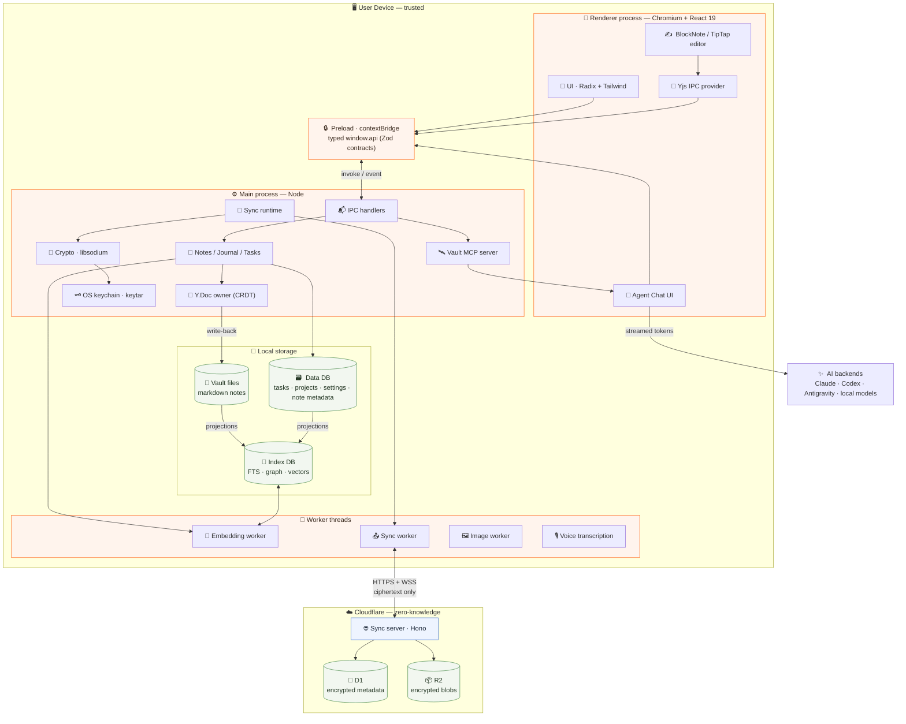
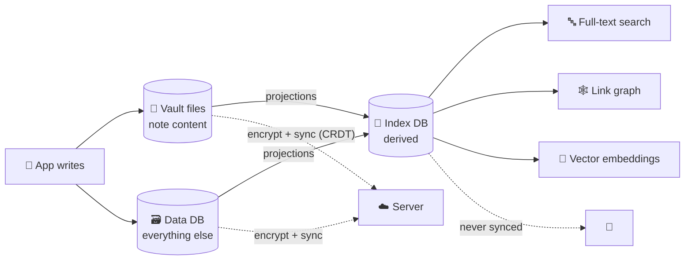
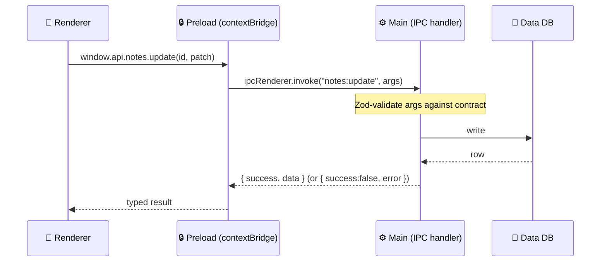
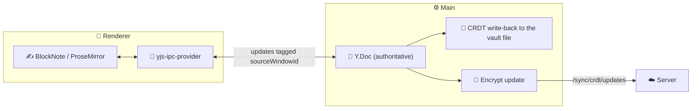
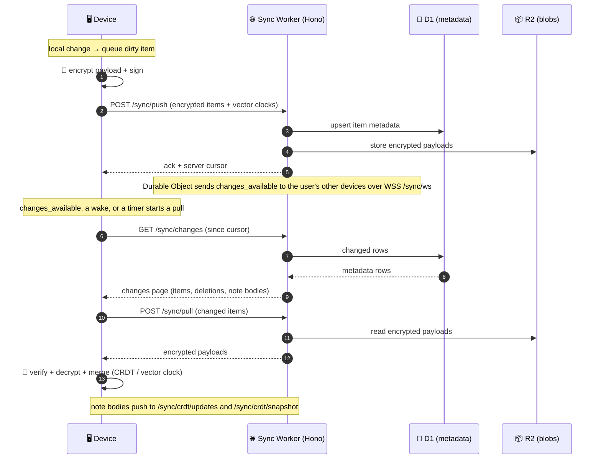
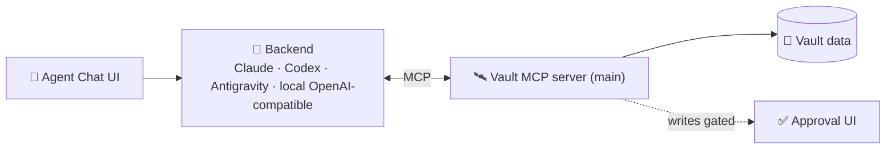

# MemryNote Desktop — Architecture

> Engineering reference for the Electron desktop app (`apps/desktop`).
> For the browsable version see the docs site under `apps/docs/src/architecture/`.

MemryNote is a **local-first, end-to-end encrypted** notes / journal / tasks app.
Your data lives on your device, in markdown vault files and local SQLite; anything
that leaves the device is encrypted client-side. The sync server stores and serves **ciphertext
only** — it never holds a key and never sees a byte of plaintext.

- **Platform**: Electron 43 (Chromium + Node), three-process model.
- **UI**: React 19 + Vite + Tailwind v4.
- **Storage**: markdown vault files for notes, plus two local SQLite databases (data + index) via Drizzle ORM.
- **Sync**: hybrid. Whole items travel as encrypted records, and note bodies as Yjs CRDT updates and snapshots.
- **Crypto**: XChaCha20-Poly1305 + Ed25519 + Argon2id via libsodium.
- **Backend**: Cloudflare Workers + Hono, D1 (metadata) + R2 (blobs).

---

## Table of contents

1. [System overview](#system-overview)
2. [Architecture diagram](#architecture-diagram)
3. [Process model](#process-model)
4. [Tech stack](#tech-stack)
5. [Monorepo layout](#monorepo-layout)
6. [Local storage — dual SQLite](#local-storage--dual-sqlite)
7. [IPC boundary](#ipc-boundary)
8. [Editor & CRDT collaboration](#editor--crdt-collaboration)
9. [Sync architecture](#sync-architecture)
10. [Cryptography & trust boundary](#cryptography--trust-boundary)
11. [Agent Chat & MCP](#agent-chat--mcp)
12. [Background workers](#background-workers)
13. [Build, package & update](#build-package--update)
14. [Verification gates](#verification-gates)

---

## System overview

The desktop app is the product; the server is dumb encrypted storage.

Every user action writes to local storage first and renders from there. A note
edit lands in the note's Y.Doc and its markdown file in the vault, and a task, a
setting, or a capture lands in the **local SQLite data DB**. Local reads and
writes need no network. A background **sync runtime** later encrypts those
changes, uploads metadata to **Cloudflare D1** and payload blobs to **R2**, and
pulls remote changes back down, decrypting them locally.

Two conflict-resolution strategies run side by side:

- **Notes & journals** use **Yjs CRDTs** — character-level merge, no conflicts,
  incremental updates pushed over HTTPS.
- **Tasks & projects** use **field-level vector clocks** — per-field
  last-writer-wins with causality tracking.

A second **index DB** mirrors content into full-text search, a link graph, and
vector embeddings for semantic search. Projections keep it fresh from each write
path. It is device-local and can be rebuilt from the vault and the data DB, so it
is never synced.

The **main process** is the trust anchor: it owns the vault files, the databases,
the encryption keys (sealed in the OS keychain via keytar), the CRDT documents, and
every network call. The **renderer** (React) holds no secrets and talks to main only
through a typed, Zod-validated IPC contract.

---

## Architecture diagram


```mermaid
flowchart TB
  subgraph Device["🖥️  User Device — trusted"]
    direction TB

    subgraph Renderer["🎨  Renderer process — Chromium + React 19"]
      UI["🧩  UI · Radix + Tailwind"]
      Editor["✍️  BlockNote / TipTap editor"]
      Agent["🤖  Agent Chat UI"]
      YProv["🔗  Yjs IPC provider"]
    end

    Preload["🔒  Preload · contextBridge<br/>typed window.api (Zod contracts)"]

    subgraph Main["⚙️  Main process — Node"]
      IPC["📬  IPC handlers"]
      Notes["📝  Notes / Journal / Tasks"]
      YDocs["🧠  Y.Doc owner (CRDT)"]
      Crypto["🔑  Crypto · libsodium"]
      Keychain["🗝️  OS keychain · keytar"]
      SyncRT["🔄  Sync runtime"]
      MCP["🛰️  Vault MCP server"]
    end

    subgraph Workers["🧵  Worker threads"]
      Embed["📐  Embedding worker"]
      SyncW["📤  Sync worker"]
      ImgW["🖼️  Image worker"]
      VoiceW["🎙️  Voice transcription"]
    end

    subgraph Storage["💾  Local storage"]
      Vault[("📁  Vault files<br/>markdown notes")]
      DataDB[("🗃️  Data DB<br/>tasks · projects · settings · note metadata")]
      IndexDB[("🔎  Index DB<br/>FTS · graph · vectors")]
    end
  end

  subgraph Cloud["☁️  Cloudflare — zero-knowledge"]
    Worker["🌐  Sync server · Hono"]
    D1[("🧮  D1<br/>encrypted metadata")]
    R2[("📦  R2<br/>encrypted blobs")]
  end

  AI["✨  AI backends<br/>Claude · Codex · Antigravity · local models"]

  UI --> Preload
  Editor --> YProv
  YProv --> Preload
  Agent --> Preload
  Preload <-->|"invoke / event"| IPC
  IPC --> Notes
  IPC --> MCP
  Notes --> YDocs
  Notes --> DataDB
  YDocs -->|write-back| Vault
  Vault -->|projections| IndexDB
  DataDB -->|projections| IndexDB
  Notes --> Embed
  IndexDB <--> Embed
  SyncRT --> Crypto
  Crypto --> Keychain
  SyncRT --> SyncW
  SyncW <-->|"HTTPS + WSS<br/>ciphertext only"| Worker
  Worker --> D1
  Worker --> R2
  MCP --> Agent
  Agent -->|streamed tokens| AI

  classDef trusted fill:#fff4ed,stroke:#ff671a,stroke-width:1px,color:#3a2a1e
  classDef cloud fill:#eef4ff,stroke:#3b6fd4,stroke-width:1px,color:#1e2a3a
  classDef store fill:#f2f7f0,stroke:#4a8a4a,stroke-width:1px,color:#213421
  class Renderer,Main,Preload,Workers trusted
  class Worker cloud
  class Vault,DataDB,IndexDB,D1,R2 store
```

**Read it as:** everything inside `🖥️ User Device` is trusted and works
offline. The only thing crossing into `☁️ Cloudflare` is ciphertext, via the
sync worker over HTTPS + secure WebSocket. AI backends see only what the user
sends them and what their MCP tools read from the vault during a turn.

---

## Process model

Electron splits the app into isolated processes. `electron-vite` builds each
target separately (`electron.vite.config.ts`).

| Process      | Runtime             | Owns                                                                        | Trust              |
| ------------ | ------------------- | --------------------------------------------------------------------------- | ------------------ |
| **Main**     | Node                | Vault files, DBs, crypto keys, Y.Docs, sync, network, window/menu lifecycle | Trust anchor       |
| **Preload**  | Isolated bridge     | `contextBridge` — exposes a typed, narrow `window.api`                      | Boundary guard     |
| **Renderer** | Chromium (React)    | UI only. No keys, no direct DB, no raw Node                                 | Untrusted for data |
| **Workers**  | Node worker threads | CPU-heavy jobs off the main thread (see [Workers](#background-workers))     | Main-spawned       |

Key rules (enforced by lint / architecture checks):

- Renderer ↔ main communication **only** through `packages/contracts` (Zod).
- `contextIsolation` on; renderer has no Node `process` (Vite shims what RGL needs).
- CRDT updates are tagged with `sourceWindowId` to prevent IPC echo loops.

`src/main/index.ts` is the bootstrap: creates windows, registers all IPC
handlers, opens the databases, and starts the sync runtime once a vault is
unlocked.

---

## Tech stack

### Runtime & framework

| Concern      | Choice                                      |
| ------------ | ------------------------------------------- |
| Shell        | Electron 43                                 |
| Bundler      | electron-vite (Vite 7 under the hood)       |
| Language     | TypeScript (strict), Node 24                |
| UI framework | React 19.3 + React DOM                      |
| Styling      | Tailwind CSS v4 (`@tailwindcss/vite`)       |
| Components   | Radix UI primitives + shadcn-style wrappers |
| Icons        | lucide-react · @hugeicons/react             |
| Onboarding   | driver.js (first-run product tour)          |
| Dashboards   | react-grid-layout (resizable Home widgets)  |

### Editor

| Concern        | Choice                                                |
| -------------- | ----------------------------------------------------- |
| Block editor   | BlockNote (`@blocknote/*`)                            |
| Schema         | `packages/editor-schema`, shared by renderer and main |
| Rich text core | TipTap + ProseMirror, through BlockNote               |
| Collaboration  | Yjs + y-protocols + y-prosemirror                     |
| Markdown       | marked · gray-matter (frontmatter) · streamdown       |

### Data & storage

| Concern          | Choice                                       |
| ---------------- | -------------------------------------------- |
| Local DB         | better-sqlite3                               |
| ORM / migrations | Drizzle ORM; hand-written SQL migrations     |
| Vector search    | sqlite-vec                                   |
| Embeddings       | @huggingface/transformers (local, in-worker) |
| Fuzzy search     | fuzzysort                                    |
| Key storage      | keytar (OS keychain)                         |
| CRDT store       | y-leveldb (LevelDB)                          |

### Crypto & sync

| Concern        | Choice                                               |
| -------------- | ---------------------------------------------------- |
| Crypto library | libsodium-wrappers-sumo                              |
| Symmetric      | XChaCha20-Poly1305                                   |
| Signatures     | Ed25519                                              |
| KDF            | Argon2id                                             |
| Recovery       | bip39 mnemonic                                       |
| Transport      | HTTPS + `ws` (secure WebSocket), certificate pinning |
| Compression    | pako · yauzl                                         |

### AI & agents

| Concern       | Choice                                                              |
| ------------- | ------------------------------------------------------------------- |
| Orchestration | Vercel AI SDK (`ai`)                                                |
| Providers     | @ai-sdk/anthropic · @ai-sdk/openai · ollama-ai-provider-v2 · openai |
| Tooling       | Model Context Protocol (`@modelcontextprotocol/sdk`)                |
| Agent Chat    | Claude, Codex, and Antigravity CLIs; local OpenAI-compatible models |
| Link capture  | metascraper · jsdom · article extraction                            |

### Backend (sync server)

| Concern        | Choice                          |
| -------------- | ------------------------------- |
| Runtime        | Cloudflare Workers              |
| HTTP framework | Hono                            |
| Metadata store | D1 (SQLite at edge)             |
| Blob store     | R2 (avoids D1's 1 MB row limit) |

### Tooling & quality

| Concern            | Choice                                                                  |
| ------------------ | ----------------------------------------------------------------------- |
| Monorepo           | pnpm workspaces + Turborepo                                             |
| Unit / integration | Vitest (shared · main · main-integration · preload · renderer projects) |
| E2E                | Playwright (drives the built Electron app in `out/`)                    |
| Lint               | ESLint (flat config) + Prettier                                         |
| Contracts          | Zod + generated IPC invoke map (`pnpm ipc:check`)                       |
| Packaging          | electron-builder                                                        |
| Updates            | Velopack on Windows, electron-updater elsewhere                         |
| Logging            | electron-log                                                            |

---

## Monorepo layout

```
memry/
├── apps/
│   ├── desktop/           Electron app (main · preload · renderer)
│   ├── cli/               memrynote CLI, bundled into the desktop app
│   ├── ios/               SwiftUI shell over the Rust core
│   ├── sync-server/       Cloudflare Workers + Hono (D1 + R2)
│   ├── extension/         Web clipper (WXT, MV3)
│   ├── landing/           Marketing site
│   ├── marketing-emails/  Campaign email templates (React Email)
│   └── docs/              VitePress documentation site
├── crates/                Rust core (memry-core), its headless CLI, Swift bindgen
├── packages/
│   ├── contracts/         IPC + API type contracts (Zod)  ← the boundary
│   ├── rpc/               RPC contract helpers
│   ├── db-schema/         Drizzle schemas (data + index DBs)
│   ├── app-core/          App/domain orchestration (shared with CLI)
│   ├── domain-notes/      Notes domain logic
│   ├── domain-tasks/      Tasks domain logic
│   ├── domain-inbox/      Inbox / capture domain logic
│   ├── storage-data/      Data DB access
│   ├── storage-vault/     Vault filesystem access
│   ├── sync-client/       Desktop sync client: pull engine, queue, merge, adapters
│   ├── sync-core/         Shared sync primitives
│   ├── editor-schema/     BlockNote schema shared by renderer and main
│   ├── article-extract/   Article extraction for captured links
│   ├── importers/         Per-source importers (Apple Notes, Bear, Evernote, OneNote, Roam, …)
│   ├── i18n/              Localization
│   ├── shared/            Minimal cross-cutting utilities
│   ├── swift/             MemryCore Swift package over the Rust core
│   └── typescript-config/ Shared tsconfig presets
```

Inside `apps/desktop/src`:

```
main/       agent · calendar · capture · crypto · database · graph · import
            inbox · ipc · journal · notes · projections · search · sync · vault …
preload/    contextBridge api + generated RPC bindings + index.d.ts
renderer/   src/{ components · contexts · features · hooks · pages · services · sync · agent-chat }
```

---

## Local storage — dual SQLite

Note content lives in markdown vault files. Everything else lives in two
databases, both better-sqlite3 + Drizzle, opened by the main process.


```mermaid
flowchart LR
  App["📝 App writes"] --> Vault[("📁 Vault files<br/>note content")]
  App --> DataDB[("🗃️ Data DB<br/>everything else")]
  Vault -->|projections| IndexDB[("🔎 Index DB<br/>derived")]
  DataDB -->|projections| IndexDB
  IndexDB --> FTS["🔤 Full-text search"]
  IndexDB --> Graph["🕸️ Link graph"]
  IndexDB --> Vec["📐 Vector embeddings"]
  DataDB -.->|encrypt + sync| Cloud["☁️ Server"]
  Vault -.->|"encrypt + sync (CRDT)"| Cloud
  IndexDB -.->|never synced| X["🚫"]
```

- **Vault files** hold note and journal content as markdown, owned by the user.
  Each note's Y.Doc writes back to its file.
- **Data DB** is the source of truth for everything that is not a vault file,
  such as tasks, projects, inbox, templates, settings, calendar, note metadata,
  sync state, and agent conversations. Synced items are encrypted before they
  leave the device.
- **Index DB** holds full-text search, the backlink graph, and `sqlite-vec`
  embedding vectors. It is device-local and can be rebuilt from the vault and the
  data DB, so it is **never synced**.

Migrations live in `src/main/database/drizzle-data` and `drizzle-index` and are
copied into the build output by a Vite plugin. They are written by hand, because
Drizzle's snapshots stop at 0021 (data) and 0020 (index) and `db:generate`
proposes unrelated changes. Each migration only adds, since existing installs
carry real data. [Common Gotchas](../apps/docs/src/contribute/gotchas.md) has the
steps.

---

## IPC boundary

The renderer never touches Node, the filesystem, keys, or the databases
directly. Every call crosses a single typed boundary.


```mermaid
sequenceDiagram
  participant R as 🎨 Renderer
  participant P as 🔒 Preload (contextBridge)
  participant M as ⚙️ Main (IPC handler)
  participant DB as 💾 Data DB
  R->>P: window.api.notes.update(id, patch)
  P->>M: ipcRenderer.invoke("notes:update", args)
  Note over M: Zod-validate args against contract
  M->>DB: write
  DB-->>M: row
  M-->>P: { success, data } (or { success:false, error })
  P-->>R: typed result
```

- Contracts are defined once in `packages/contracts` and shared by both sides.
- `pnpm ipc:generate` builds the invoke map from RPC contracts; `pnpm ipc:check`
  fails CI if the map drifts from the contracts.
- Handlers registered through `registerCommand` wrap results in a
  `{ success, data | error }` envelope, so an error the command throws
  **resolves** as `{ success: false }`. Input that fails contract validation
  rejects instead, so call sites handle both.

Run `pnpm ipc:generate` before `pnpm ipc:check` after editing contracts, preload
APIs, main handlers, or Agent Chat channels.

---

## Editor & CRDT collaboration

Notes and journals are collaborative documents backed by **Yjs**. The main
process is the single owner of every `Y.Doc`; the renderer edits through an IPC
provider so there is exactly one authoritative copy per document.


```mermaid
flowchart LR
  subgraph R["🎨 Renderer"]
    BN["✍️ BlockNote / ProseMirror"]
    Prov["🔗 yjs-ipc-provider"]
  end
  subgraph M["⚙️ Main"]
    Doc["🧠 Y.Doc (authoritative)"]
    WB["💾 CRDT write-back to the vault file"]
    Enc["🔑 Encrypt update"]
  end
  BN <--> Prov
  Prov <-->|"updates tagged sourceWindowId"| Doc
  Doc --> WB
  Doc --> Enc
  Enc -->|"/sync/crdt/updates"| Cloud["☁️ Server"]
```

- Edits produce incremental Yjs updates, merged conflict-free (character level).
- Updates carry `sourceWindowId` so an update echoed back over IPC is ignored —
  no feedback loops between windows.
- Write-backs debounce the document into its vault file as markdown, and pending
  write-backs flush on shutdown so nothing is lost. The Y.Doc state itself
  persists in a LevelDB store (y-leveldb).
- Renderer and main build their BlockNote schema from `packages/editor-schema`.
  A node only one side can build is deleted from the shared document, and the
  deletion syncs to every device.
- **Tasks & projects** don't use CRDTs — they sync via **field-level vector
  clocks** (`packages/sync-client/src/field-merge.ts`, `vector-clock.ts`) for per-field
  last-writer-wins with causality.

---

## Sync architecture

Sync is **hybrid**. Whole items travel as encrypted records, and note bodies as
CRDT updates and snapshots. Metadata goes to D1, and encrypted payloads go to R2
(D1 caps rows at 1 MB). The docs site's
[Sync Protocol](../apps/docs/src/architecture/sync-protocol.md) page has the full
wire behavior.


```mermaid
sequenceDiagram
  autonumber
  participant Dev as 🖥️ Device
  participant W as 🌐 Sync Worker (Hono)
  participant D1 as 🧮 D1 (metadata)
  participant R2 as 📦 R2 (blobs)

  Note over Dev: local change → queue dirty item
  Dev->>Dev: 🔑 encrypt payload + sign
  Dev->>W: POST /sync/push (encrypted items + vector clocks)
  W->>D1: upsert item metadata
  W->>R2: store encrypted payloads
  W-->>Dev: ack + server cursor
  Note over W: Durable Object sends changes_available to the user's other devices over WSS /sync/ws

  Note over Dev: changes_available, a wake, or a timer starts a pull
  Dev->>W: GET /sync/changes (since cursor)
  W->>D1: changed rows
  D1-->>W: metadata rows
  W-->>Dev: changes page (items, deletions, note bodies)
  Dev->>W: POST /sync/pull (changed items)
  W->>R2: read encrypted payloads
  W-->>Dev: encrypted payloads
  Dev->>Dev: 🔑 verify + decrypt + merge (CRDT / vector clock)

  Note over Dev,W: note bodies push to /sync/crdt/updates and /sync/crdt/snapshot
```

Server-side design:

- **D1** stores encrypted item metadata: vector clocks, blob keys, content
  hashes, per-vault scoping (`X-Memry-Vault-Id` — sync is **per-vault**, not
  per-account).
- **R2** stores the encrypted payload blobs. Attachments move as
  content-addressed chunks inside an upload session the Worker opens and
  completes. Chunk bytes go straight to R2 over presigned URLs when the
  deployment configures them, and through the Worker when it does not.
- Per-type behavior lives in `src/main/sync/item-handlers/` behind a strategy
  registry (`getHandler(type)`); adding a synced entity = adding a handler.
- Multi-device onboarding pairs devices (QR / code) and adopts the initiator's
  `vault_uuid` so both devices sync the same vault.

Client sync internals live in `packages/sync-client` (pull engine, queue, field
merge, vector clocks, platform adapters) and `src/main/sync/` (runtime, item
handlers, CRDT provider, WebSocket, upload queue, …).

---

## Cryptography & trust boundary

**The device is trusted. The server is not.** The server stores and returns
ciphertext; it has no key and can decrypt nothing.

| Purpose               | Primitive                 |
| --------------------- | ------------------------- |
| Symmetric encryption  | XChaCha20-Poly1305 (AEAD) |
| Signatures / identity | Ed25519                   |
| Passphrase → key      | Argon2id                  |
| Recovery phrase       | bip39 mnemonic            |
| Transport security    | TLS + certificate pinning |

- A per-vault **vault key** encrypts all content. It is **sealed per device** —
  each device wraps the vault key with its own key material and stores the sealed
  blob; the OS keychain (keytar) holds device secrets.
- All payloads are encrypted **before** they touch the network; blob keys and
  hashes in D1 reveal nothing about content.
- Comparisons are constant-time; certificate pins are checked on every sync
  connection (`src/main/sync/certificate-pinning.ts`).

---

## Agent Chat & MCP

Agent Chat is **MCP-first**: a single localhost **Vault MCP server** runs in the
main process and exposes the vault to AI backends through the Model Context
Protocol.


```mermaid
flowchart LR
  Chat["🤖 Agent Chat UI"] --> Backend["🧠 Backend<br/>Claude · Codex · Antigravity · local OpenAI-compatible"]
  Backend <-->|MCP| Vault["🛰️ Vault MCP server (main)"]
  Vault --> DB[("💾 Vault data")]
  Vault -.->|writes gated| Approve["✅ Approval UI"]
```

- One MCP server, reused by the Claude, Codex, and Antigravity CLIs and by local
  OpenAI-compatible backends.
- **External MCP clients are read-only.** A write needs a running Agent Chat
  turn, and it waits for inline approval unless the user set Agent Permissions
  to Always allow.
- Provider / model / reasoning selections persist as **conversation settings**,
  not one-shot composer state.
- The tools and their registry live in `src/main/agent/mcp/`.

User-facing behavior: `apps/docs/src/user-guide/ai/agent-mcp.md`.

---

## Background workers

CPU-heavy work runs in Node worker threads so the main thread stays responsive.
Declared as separate rollup inputs in `electron.vite.config.ts`.

| Worker                       | Job                                                 |
| ---------------------------- | --------------------------------------------------- |
| `embedding-worker`           | Generate local text embeddings for semantic search  |
| `sync-worker`                | Off-thread encrypt/decrypt + sync payload crunching |
| `image-processing-worker`    | Thumbnail / image processing (sharp)                |
| `voice-transcription-worker` | Voice note → text transcription                     |
| `large-file-index-worker`    | Line-offset index and search for very large files   |
| `ocr-worker`                 | OCR for attachment text extraction (Tesseract)      |

---

## Build, package & update

```bash
pnpm dev                              # run the app (electron-vite dev)
pnpm --filter @memry/desktop build    # typecheck + electron-vite build → out/
pnpm --filter @memry/desktop build:mac    # package (electron-builder)
pnpm --filter @memry/desktop build:win
pnpm --filter @memry/desktop build:linux
```

- `electron-vite` builds `main`, `preload`, and `renderer` separately; native
  modules (`better-sqlite3`, `keytar`, `classic-level`) are kept external and
  rebuilt for the target ABI.
- **Native ABI matters**: Node tests need `rebuild:node`; Electron runtime needs
  `rebuild:electron`. They are not interchangeable.
- `src/main/updater.ts` picks one updater backend per launch. Packaged Windows
  builds installed by Velopack update through Velopack. Older NSIS installs keep
  electron-updater until an update hands them to the Velopack installer. Every
  other platform uses electron-updater.

---

## Verification gates

```bash
pnpm lint                 # ESLint over apps/desktop
pnpm typecheck            # shared packages, CLI, desktop, sync server
pnpm test                 # package, CLI, desktop, sync-server, and landing tests
pnpm test:e2e             # Playwright E2E (Electron)
pnpm ipc:check            # renderer↔main contract integrity
pnpm check:architecture   # architecture boundary rules
pnpm check:contracts      # contract boundary rules
```

A change is done when the gates that cover it are green — not before.
