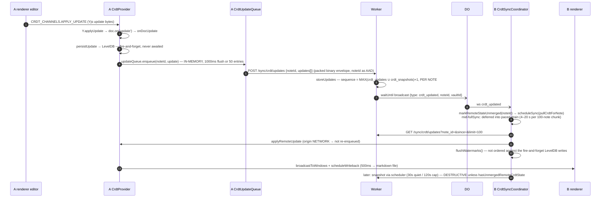
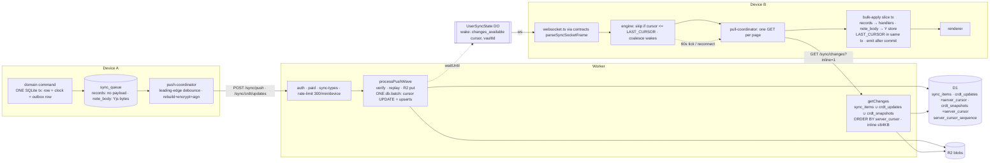

# Sync architecture audit and redesign plan

Date: 2026-09-20. Owner: Kaan. Status: proposed. Baseline: `main` @ `6b235dae4`.

Tracking epic: #2279. Child issues are linked from each step in §7.

## 1. Question and answer

**Question.** If memry's sync were rebuilt from scratch today, what would be different and
better? Specifically: when an item is created on a paid account, can the device → sync
server → other devices path be substantially faster and safer than it is now, as a
best-practice architecture?

**Answer.** The architecture is right; the mechanics are not.

Keep: WS wake channel + HTTP pull, D1 as the sequencer, one per-user monotonic integer
cursor, E2E envelope (XChaCha20-Poly1305 + Ed25519 over CBOR + Argon2id), content-addressed
R2 blobs written before D1 rows, `bulk-apply.ts` page transactions with a crash journal,
per-user hibernating Durable Object for fan-out, vector clocks for records and Yjs for note
bodies.

Fix:

- p50 propagation is ~3–5 s. **2000 ms of that is a single client constant**
  (`PUSH_DEBOUNCE_MS`), ~350 ms is a redundant second round trip (`/sync/changes` then
  `/sync/pull`).
- **Two silent skip-forever loss paths**, both in cursor semantics: cursor allocated in a
  different D1 transaction than the row commit, and a device's own push response advancing
  its own pull cursor.
- Note bodies ride a separate feed with a separate ordering token; if the `crdt_updated`
  wake is lost the fallback is **15 minutes**. For records, with a healthy socket, a lost
  wake costs up to **5 minutes** (not 60 s).
- Crash recovery for local mutations covers 4 of 17 `syncedAt` tables. Schema drift between
  client versions is silent permanent loss. One handler (`journal`) writes outside its page
  transaction.
- Three client queues, two ordering tokens, two envelope formats, three payload-construction
  paths for the same row.

All of it closes with additive changes that keep every shipped client syncing. Target:
p50 ~0.5–1 s (optionally ~0.3 s with a WS fast path), zero known skip-forever paths, and
roughly 1500 lines of CRDT sweep/drain/watermark code deleted.

## 2. Method

pstack pipeline, all read-only against the tree:

1. Four `how` explorers (sonnet-5) in parallel: write/push path, server, pull/apply path,
   scheduling/lifecycle/timing.
2. One `how` explainer (opus-5) reconciled the four traces into a single model with
   diagrams, a latency budget and a gap list.
3. Two `arena` candidates redesigned from that model: A (opus-5, evolutionary lens),
   B (fable-5-1, day-one lens).
4. Lead synthesis: base + grafts, with every load-bearing claim re-verified in the code.

Raw artifacts (explorer reports, the synthesized model, both candidates, the synthesis
note) were produced under `/tmp/sync-arch/`; the content that matters is folded into this
document. `docs/protocol/*.md` was treated as a claim, not as truth; divergences are listed
in §5.

## 3. Current architecture

### 3.1 Overview

memry syncs two logically separate feeds over one HTTP + WebSocket transport.

The **record feed** carries per-item encrypted blobs (tasks, projects, note _metadata_,
settings, calendar, bookmarks, …; ~24 types in `RECORD_SYNC_ITEM_TYPES`) ordered by a single
per-user monotonic integer, the **server cursor**. Conflicts are resolved by **vector
clocks**: whole-record last-writer-wins for most types, per-field merge for `task` and
`project` (`packages/sync-client/src/field-merge.ts`, winner = higher tick sum).

The **CRDT feed** carries Yjs updates for note _bodies_ only, ordered by a **per-note
sequence number**, merged by Yjs semantics. The two feeds share nothing but auth, vault
scoping, quota and the WebSocket wake channel. A note edit therefore splits: title, tags and
folder go through the record feed, the body goes through the CRDT feed, and they can reach
device B minutes apart.

The server is a Cloudflare Worker (Hono). Metadata lives in **D1** (`sync_items`,
`crdt_updates`, `crdt_snapshots`, `device_sync_state`, `server_cursor_sequence`), ciphertext
in **R2** under content-addressed keys, and a per-user **Durable Object** (`UserSyncState`)
holds WebSocket fan-out. The server validates byte lengths, verifies an Ed25519 signature
over a CBOR-canonicalized field subset, and enforces replay and delete-wins rules on opaque
clocks. It never sees plaintext.

Delivery is pull-based. The DO broadcast is a hint ("something moved, cursor ≈ N"); device B
always runs its own cursor-paged pull. Sync is gated on a paid entitlement at runtime start
(`resolveEntitlementForSyncStart`) and per request (`paidSyncMiddleware`).

### 3.2 Key concepts

| Concept               | What it is                                                                                                                                                                                                                                      | Where                                                     |
| --------------------- | ----------------------------------------------------------------------------------------------------------------------------------------------------------------------------------------------------------------------------------------------- | --------------------------------------------------------- |
| Record feed           | `sync_items` rows + R2 blobs. `POST /sync/push` (1–100), `GET /sync/changes?cursor=&limit=`, `POST /sync/pull {itemIds}`                                                                                                                        | `apps/sync-server/src/routes/sync.ts`, `services/sync.ts` |
| CRDT feed             | `POST /sync/crdt/updates` (append-only), `POST /sync/crdt/snapshot[/batch]` (**destructive**: overwrites the snapshot, prunes `crdt_updates` at/below the watermark), `GET /sync/crdt/updates?note_id=&since=`, `POST /sync/crdt/updates/batch` | `services/crdt.ts`                                        |
| Server cursor         | One `server_cursor_sequence` row **per user**. `allocateCursorRange()` = `UPDATE … SET current_cursor = current_cursor + N RETURNING`. Every reader pages `WHERE server_cursor > ? ORDER BY server_cursor`                                      | `services/cursor.ts`                                      |
| Vector clock          | `{deviceId: tick}`. `compare()` → `before \| after \| equal \| concurrent`. `resolveClockConflict()`: `after` → skip, `concurrent` → merge, everything else including `equal` → apply                                                           | `packages/sync-client/src/item-handlers/types.ts:58`      |
| Outbox (`sync_queue`) | Durable SQLite work list on the writing device. Coalesces by `(type,itemId)` while `attempts=0`; dead-letters at 5 attempts; purged after 7 days                                                                                                | `packages/sync-client/src/queue.ts`                       |
| Packs                 | Immutable R2 bundles (≤256 items / 24 MB) built by a Queue consumer + 6-hourly cron backfill for first sync. `PACKED_KINDS = ['crdt_snapshot']` only                                                                                            | `services/pack-*.ts`                                      |
| DO wake channel       | `UserSyncState`, `idFromName(userId)`, filters sockets by attached `vaultId`, excludes the originating device. Fire-and-forget                                                                                                                  | `durable-objects/user-sync-state.ts`                      |
| Vault                 | Scoping unit. `X-Memry-Vault-Id`; `sync_items` keyed `(user_id, vault_id, item_type, item_id)`                                                                                                                                                  |                                                           |
| Entitlement           | `sync_entitlements`; `assertPaidSyncAccess` → 402 unless paid, active, unexpired. `version_history_days` (0 / 30 / 365) also bounds tombstone retention                                                                                         | `services/entitlements.ts`                                |
| Second client         | iOS runs a Rust core (`crates/memry-core/src/sync`, UniFFI → `packages/swift/MemryCore`). Every wire change is implemented twice. Its outbox (`outbox.rs`) already refuses autocommit                                                           |                                                           |

### 3.3 Component diagram (today)

```mermaid
flowchart LR
  subgraph A[Device A - Electron main]
    A1[ipc/tasks-handlers.ts] --> A2[domain-tasks/commands.ts + tasks/publisher.ts]
    A2 --> A3[sync/local-mutations.ts localSyncRegistry]
    A3 --> A4[sync-core/record-sync.ts clock bump]
    A4 --> A5[(sync_queue outbox)]
    A5 --> A6[engine/push-coordinator.ts<br/>2000ms trailing debounce]
    A6 --> A7[sync-crypto-batch.ts + worker.ts]
    AC1[ipc/crdt-handlers.ts] --> AC2[crdt-provider.ts Y.Doc]
    AC2 --> AC3[crdt-queue.ts IN-MEMORY<br/>1000ms flush]
    AC3 --> AC4[crdt-encrypt.ts]
  end
  subgraph W[Cloudflare Worker]
    M[middleware: auth · client-gate · paid-sync<br/>sync-types · rate-limit push 60/min PER USER]
    R[routes/sync.ts]
    S[services/sync.ts processPushWave<br/>stage 7 alloc cursor = db.batch 1<br/>stage 8 upsert = db.batch 2]
    CU[services/crdt.ts storeUpdates<br/>per-note sequence_num]
  end
  D1[(D1: sync_items · crdt_updates · crdt_snapshots<br/>device_sync_state · server_cursor_sequence)]
  R2[(R2: items-v3 blobs · snapshots · packs)]
  DO[[UserSyncState DO - per user<br/>wake only: cursor, vaultId]]
  subgraph B[Device B - Electron main]
    B1[websocket.ts] --> B2[engine.ts scheduleSync<br/>no coalescing, FIFO behind in-flight]
    B2 --> B3[pull-coordinator.ts<br/>GET /changes then POST /pull]
    B3 --> B5[decrypt worker] --> B6[bulk-apply.ts page tx] --> B7[item-handlers/*] --> B8[renderer]
    B2 --> BC[crdt-sync-coordinator.ts<br/>per-note pull · 15min vault sweep]
    BC --> AC2B[crdt-provider.ts]
  end
  A7 -->|POST /sync/push| M --> R --> S
  S --> R2
  S --> D1
  AC4 -->|POST /sync/crdt/updates| M
  R --> CU --> D1
  R -.->|waitUntil /broadcast| DO
  DO -->|changes_available| B1
  DO -->|crdt_updated| B1
```



### 3.4 Item journey: one task created on device A, until visible on device B

```mermaid
sequenceDiagram
  autonumber
  participant RA as A renderer
  participant MA as A main
  participant QA as A sync_queue
  participant WK as Worker
  participant D1 as D1
  participant R2 as R2
  participant DO as UserSyncState DO
  participant MB as B main
  participant RB as B renderer

  RA->>MA: tasks.create (IPC)
  MA->>MA: INSERT tasks row — SQLite txn 1
  MA->>MA: applyLocalChange clock + fieldClocks — SQLite txn 2
  MA->>QA: enqueue sync_queue row — SQLite txn 3
  Note over MA,QA: three uncoordinated txns; crash between 2 and 3 = clocked row, no outbox row
  QA->>MA: onItemEnqueued → requestPush()
  Note over MA: PUSH_DEBOUNCE_MS = 2000 setTimeout<br/>if a cycle is running: requestPush() again = re-arm +2000
  MA->>MA: dequeue(100) → resolvePushPayload rebuilds from live row → encrypt in worker
  MA->>WK: POST /sync/push (60s timeout, no 5xx retry, batch halves on 5xx)
  WK->>WK: stages 1–4: validate, Ed25519 verify, existing rows, replay/delete-wins
  WK->>D1: reserveStorage
  WK->>R2: putBlob items-v3/{type}/{id}/{hash} (content-addressed, idempotent)
  WK->>D1: allocateCursorRange — SEPARATE db.batch
  WK->>D1: UPSERT sync_items — SEPARATE db.batch
  Note over D1: another device can commit a higher cursor between the two
  WK-->>MA: 200 {accepted, rejected, maxCursor}
  MA->>QA: markSuccess (conditional delete) + markItemSynced
  MA->>MA: LAST_CURSOR = max(LAST_CURSOR, maxCursor)
  Note over MA: own push advances own PULL cursor (push-coordinator.ts:366-374)
  WK-)DO: waitUntil stub.fetch(/broadcast {cursor, vaultId, excludeDeviceId})
  DO-)MB: ws {type: changes_available, payload: {cursor, vaultId}} — fire-and-forget
  MB->>MB: scheduleSync(pull) — cursor in payload ignored; FIFO behind in-flight cycle
  MB->>MB: replayBulkApplyJournal()
  MB->>WK: GET /sync/changes?cursor=&limit=500
  MB->>WK: POST /sync/pull (≤100 ids)
  MB->>MB: decryptPullBatch in worker + Ed25519 verify
  MB->>MB: beginPageApply BEGIN IMMEDIATE (data + index DB), one txn per 100-id slice
  MB->>MB: sortByApplyOrder → ItemApplier.apply → task-handler.applyUpsert
  MB->>RB: ctx.emit TasksChannels.events.UPDATED — INSIDE the txn, before commit
  MB->>MB: pageApply.commit() → flushFiles()
  MB->>MB: LAST_CURSOR = nextCursor — after ALL slices of the 500-ref page
  RB->>RB: query invalidate, task visible
```

### 3.5 Note body journey (CRDT path) and where it diverges



Divergences from the record path:

1. No outbox. Durability = LevelDB doc store + `crdt-pending-notes.ts` (a durable "this note
   has unflushed edits" list drained at next start by pushing the note's **full** state;
   individual updates are not replayable).
2. No per-item verdict. `/sync/crdt/updates` returns `{sequences}`; the request fully lands or
   fully throws. No replay detection, no idempotency key.
3. Different ordering token. Per-note `sequence_num`; a body change never appears in
   `/sync/changes`.
4. Different envelope. One packed binary blob (`dataNonce|keyNonce|wrappedKey|signature|ciphertext`)
   base64'd into JSON vs five JSON fields on the record path. Same primitives, incompatible
   framing.
5. Different discovery fallback. If `crdt_updated` is lost, the record tick does not help; the
   only other channel is the vault-wide sweep at the end of `fullSync`, throttled to
   `CRDT_FULL_SWEEP_MIN_INTERVAL_MS` = 15 min.
6. Note metadata still rides the record feed with `content: null` on every update
   (`note-sync.ts:99`, `journal-sync.ts:75`); the body rides the record path only on `create`.

### 3.6 Triggers and scheduling

Nothing polls for local dirt in steady state. `SyncQueueManager.enqueue()` fires
`onItemEnqueued` → `engine.requestPush()` → one 2000 ms timer. On fire, if
`ctx.syncing || ctx.fullSyncActive`, it calls `requestPush()` again: a re-arm, not a queue.

Pull triggers: WS `changes_available` (`engine.ts handleWsMessage` → `scheduleSync(pull)`),
WS reconnect (`handleWsConnected`: pull, per-open-note CRDT pull, inactive-doc sweep), network
offline→online (`network.ts` polls `electron.net.online` at 5 s offline / 30 s online +
`powerMonitor` resume), and a 60 s `setInterval` (`engine.armPeriodicPull`). The 60 s tick
**skips the pull while the same socket has been continuously connected for less than
`PERIODIC_PULL_MAX_QUIET_MS` = 5 min** (`engine.ts:91,672`). The same tick also carries
`recoverStaleSyncLock()` (15 min) and `payOwedInactiveCrdtSweep()`.

Everything funnels through `SyncEngine.scheduleSync()` → `ctx.inFlightSync` chain →
`acquireSyncLock()`. Push and pull never run concurrently on one engine. A burst of N
`changes_available` frames produces N serial pull cycles; only pushes are debounced.

### 3.7 Where things live

```
apps/desktop/src/main/sync/
  runtime.ts                  start/stopSyncRuntime, wires every service, crdtQueue pushFn
  engine.ts                   SyncEngine: WS/network handlers, 60s tick, sync lock
  engine/sync-context.ts      every timing/size constant
  engine/push-coordinator.ts  debounce, dequeue, encrypt, POST /sync/push, verdicts
  engine/pull-coordinator.ts  cursor paging, slices, decrypt, apply, retries, orphan repair
  engine/full-sync-runner.ts  packs → pull → seed → push → manifest → CRDT sweep
  engine/crdt-sync-coordinator.ts  CRDT pull, probe+batch sweep, watermarks, unmerged debt
  engine/{quarantine-manager,corrupt-item-tracker,orphan-repair,error-recovery-handler}.ts
  apply-item.ts / bulk-apply.ts    per-item dispatch; page transaction + crash journal
  item-handlers/*.ts          applyUpsert/applyDelete/buildPushPayload per type + registry
  local-mutations.ts          localSyncRegistry: the only "sync learns about a mutation" seam
  dirty-recovery.ts           startup sweep, modifiedAt > syncedAt — tasks/projects/note_metadata/inbox only
  manifest-check.ts           30-min inventory diff, (type,id) presence only
  pending-deletes.ts          durable tombstones for deletes raised while sync was down
  crdt-provider.ts            owns every Y.Doc; applyIpcUpdate/applyRemoteUpdate/onDocUpdate
  crdt-queue.ts crdt-encrypt.ts crdt-writeback.ts crdt-persistence.ts crdt-pending-notes.ts
  websocket.ts network.ts http-client.ts token-manager.ts auth-retry.ts key-verification.ts

packages/sync-core/src/record-sync.ts     RecordSyncController: clock bump + enqueue
packages/sync-client/src/{queue,field-merge,vector-clock,retry,sync-eligibility,crdt-snapshot-scheduler}.ts
packages/contracts/src/{sync-api,sync-socket,sync-payloads}.ts

apps/sync-server/src/
  routes/sync.ts              all /sync/* endpoints + rate limiters
  services/sync.ts            processPushWave (9 stages), getChanges, pullItems, getManifest
  services/{cursor,blob,quota,entitlements,crdt,cleanup}.ts
  services/pack-{compaction,consumer,backfill,list,format}.ts
  durable-objects/{user-sync-state,rate-limiter}.ts
  middleware/{auth,paid-sync,client-gate,sync-types,rate-limit}.ts
  migrations/*.sql            additive, forward-only D1 schema

crates/memry-core/src/sync/   iOS client: outbox.rs, push.rs, pull.rs, apply.rs, socket.rs, …
```

## 4. Latency budget (today)

Device A mutation → device B UI, both online, WS connected, small item.

### Task (record feed)

| Contribution                      | Constant / source                                 | Best       | Typical                    |
| --------------------------------- | ------------------------------------------------- | ---------- | -------------------------- |
| IPC + 3 local SQLite txns         |                                                   | ~2 ms      | ~5 ms                      |
| Push debounce                     | `PUSH_DEBOUNCE_MS = 2000` (`sync-context.ts:418`) | 2000 ms    | 2000 ms (+2000 per re-arm) |
| Wait for sync lock                | `acquireSyncLock`, serial with pull/fullSync      | 0          | 0–5 s                      |
| Encrypt batch                     | worker thread                                     | ~3 ms      | ~10 ms                     |
| `POST /sync/push` RTT             |                                                   | 60 ms      | 150 ms                     |
| Server push pipeline              | 9 stages, R2 put + 2 D1 batches                   | 60 ms      | 150–300 ms                 |
| DO broadcast                      | `waitUntil`, after the response                   | 5 ms       | 20–50 ms                   |
| B schedules pull                  | no debounce, FIFO behind in-flight cycle          | 0          | 0–2 s                      |
| `GET /sync/changes`               | limit 500                                         | 60 ms      | 150 ms                     |
| `POST /sync/pull`                 | ≤100 ids, R2 gets concurrency 25                  | 80 ms      | 200 ms                     |
| Decrypt + verify + apply + commit |                                                   | 10 ms      | 40 ms                      |
| IPC to renderer                   | emitted before commit                             | 5 ms       | 20 ms                      |
| **Total**                         |                                                   | **~2.3 s** | **~3–5 s**                 |
| Wake lost, socket healthy         | `PERIODIC_PULL_MAX_QUIET_MS`                      |            | **+0–5 min**               |
| Wake lost, socket down            | 60 s tick                                         |            | +0–60 s                    |
| Cold start / cursor stale >24 h   | `STALE_CURSOR_THRESHOLD_MS` → full re-pull        |            | minutes                    |

### Note body (CRDT feed)

| Contribution                                 | Constant / source                             | Best        | Typical          |
| -------------------------------------------- | --------------------------------------------- | ----------- | ---------------- |
| Keystroke → Y.Doc → buffer                   |                                               | ~1 ms       | ~2 ms            |
| Flush wait                                   | `FLUSH_INTERVAL_MS = 1000` or 50 entries      | 0           | 500 ms           |
| Encrypt + `POST /sync/crdt/updates`          | retry 3 × 2000 ms                             | 70 ms       | 180 ms           |
| Server `storeUpdates` (D1 only)              |                                               | 40 ms       | 120 ms           |
| DO broadcast `crdt_updated`                  |                                               | 5 ms        | 30 ms            |
| B `markRemoteStateUnmerged` + schedule       | deferred into paced drain mid-fullSync        | 0           | 0–20 s           |
| `GET /sync/crdt/updates?since=`              |                                               | 60 ms       | 150 ms           |
| Decrypt + `Y.applyUpdate` + window broadcast |                                               | 5 ms        | 15 ms            |
| **Total**                                    |                                               | **~180 ms** | **~1–1.5 s**     |
| Wake lost                                    | vault sweep `CRDT_FULL_SWEEP_MIN_INTERVAL_MS` |             | **up to 15 min** |
| Markdown file on disk at B                   | `WRITEBACK_DEBOUNCE_MS = 500`                 | +500 ms     | +0.5–5 s         |

A note edit that changes title and body arrives at device B as two events, ~2 s apart in the
happy case and up to 14 minutes apart with a lost wake.

## 5. Gaps, inconsistencies, risks

Every entry re-verified in the tree at the baseline commit. Rated `loss` / `latency` /
`complexity` / `inconsistency`. Ordered by how much it should shape the redesign.

### Loss

**L1. Cursor allocated in a different D1 transaction than the row commit.**
`allocateCursorRange` runs at stage 7 (`services/sync.ts:634`) as its own `db.batch`
(`services/cursor.ts:26-45`); the `sync_items` UPSERT is stage 8 (`:722`), a second
`db.batch`. Device X allocates [10..12], device Y allocates [13], Y commits first. Any reader
that advances past 13 never sees 10–12: every read is `WHERE server_cursor > ?`
(`services/sync.ts:881,926,990`). `manifest-check.ts` repairs a skipped _create_ within 30
minutes; a skipped _update_ to an existing item is detected by nothing.

**L2. A device's own push response advances its own pull cursor.**
`push-coordinator.ts:366-374`: `if (lastMaxCursor > currentCursor) setStateValue(LAST_CURSOR, lastMaxCursor)`.
`LAST_CURSOR` means "I have applied everything ≤ N". A's own item landing at N says nothing
about peer items at N−5 that A has not pulled. No race is required, only "a peer write is
unpulled when A pushes". Fixing L1 does **not** close this.

**L3. Three uncoordinated local transactions; crash recovery covers 4 of 17 tables.**
Row (`packages/domain-tasks/src/commands.ts` via `tasks/publisher.ts` → `runtime-effects.ts`),
clock (`record-sync.ts applyLocalChange`), outbox (`queue.ts enqueue`, own `db.transaction`).
A crash between the second and third leaves a clocked row with no queue row.
`dirty-recovery.ts` rescans only `tasks`, `projects`, `note_metadata`, `inbox_items`, while 17
schema files under `packages/db-schema/src/schema/` carry `syncedAt`. A bookmark, canvas,
reminder, template or calendar edit in that window is permanently, silently lost. The iOS
Rust core forbids this shape: `crates/memry-core/src/sync/outbox.rs:218` refuses autocommit.

**L4. `journal-handler.applyUpsert` writes outside its page transaction.**
`item-handlers/journal-handler.ts:66-156` calls
`writeJournalEntryWithContent(...).then(async ({entry, fileContent}) => { saveCanonicalNote(...); syncNoteToCache(...) })`
and returns `'applied'` before the promise settles. The DB write runs after
`pageApply.commit()` on the shared better-sqlite3 connection (autocommit alone, or inside the
next page's `BEGIN IMMEDIATE` and rolled back with it), bypasses the bulk-apply crash journal,
a rejection only logs, and the caller has already counted the item and advances the cursor.
The only handler that breaks the invariant `bulk-apply.ts`'s header documents.

**L5. Schema drift is permanent, silent, per-item loss.**
`apply-item.ts:95-109`: a payload that fails `handler.schema.parse` returns `'skipped'`, the
same bucket as "local is newer": cursor advances, never retried. `pull-coordinator.ts` drops
an entire ≤100-id slice when `RecordPullResponseSchema.safeParse` fails (`pull_page_dropped`)
and still advances. This is exactly the scenario the backward-compatibility rule exists for.

**L6. CRDT watermark can outrun the update writes it certifies.**
`crdt-provider.onDocUpdate` → `persistUpdate` is fire-and-forget; `CrdtSyncCoordinator`
applies N remote updates then `await flushWatermarks()`. No join. A crash after the watermark
lands but before a LevelDB write does leaves a doc missing a peer's edit with a watermark that
says "merged through N", so the sweep never re-fetches it.

**L7. Dead-lettering is silent.** `queue.ts`: at `DEFAULT_MAX_ATTEMPTS = 5` a row stops
matching `dequeue` forever, one telemetry ping, purged after 7 days. For the ~13 types without
`syncedAt` recovery the mutation is gone.

**L8. Tombstone purge outruns offline devices.** `services/cleanup.ts cleanupExpiredTombstones`
deletes `sync_items` rows outright past `version_history_days`. No tombstone-of-a-tombstone; a
device offline longer than the window resurrects the item on its next push.

**L9. A `sync_items` row whose R2 blob 404s is skipped forever.** `pullItems` drops it from the
page ("a replaced item re-arrives at a later cursor"), true for replacement, false for a lost
blob. The manifest still advertises the item. No reconciliation sweep.

**L10. Offline clock bumps create no outbox row.** `getDeviceId()` null →
`increment*ClockOffline` under pseudo-device `_offline`, nothing in `sync_queue`. Recovery =
`recoverDirtyItems`, same 4-table coverage as L3.

**L11. `settings` field clocks keyed by the literal `'local'`.** `local-mutations.ts:911` and
`ipc/sync-core-handlers.ts:298` call `updateField(fieldPath, value, 'local')`;
`SettingsSyncDeps.getDeviceId` (`settings-sync.ts:25`) is injected and never read. Every
device increments the same key, so concurrent edits produce numerically equal clocks →
`compare()` = `'equal'` → `mergeRemote` takes remote: a silent lost update with no conflict
signal. `SettingsSyncManager.mergeRemote` is also a hand-written tick-max merge that
contradicts `docs/protocol/06 §6.9` (tick-sum).

**L12. Push/pull race on the rebuilt payload.** `resolvePushPayload` reads the live row at
dequeue with no serialization against a concurrent `applyUpsert` on another device. Two
devices merging the same pair in a sub-second window can settle on opposite winners.
Documented as undefined in `docs/protocol/06 §6.6.2`.

### Latency

**T1. Flat 2000 ms trailing push debounce with re-arm spin** (`sync-context.ts:418`,
`push-coordinator.ts:429-449`). 2000 of a ~3500 ms p50. Root cause: the server push bucket is
`60/60 s per user` (`routes/sync.ts:212-216`, no `identifier` → userId chain) while the CRDT
push bucket is `300/60 s per device` (`:582-586`). The debounce protects a bucket that is 5×
too small.

**T2. Fan-out is a hint; B re-fetches bytes the Worker just held.** Broadcast body is
`{excludeDeviceId, cursor, vaultId}` (`routes/sync.ts:436-445`); B pays `GET /sync/changes`

- `POST /sync/pull` + R2 gets for a payload that was in `entry.payloadBytes` at
  `services/sync.ts:722`. Plus 0–2 s behind an in-flight cycle on `acquireSyncLock`.

**T3. Wake cursor ignored; pulls not coalesced.** `engine.ts:795-802` schedules a full pull
per frame; N frames = N serial `/sync/changes` calls. `changes_available.cursor` is parsed and
unused.

**T4. Note bodies have no cheap fallback discovery.** See §3.5 item 5. Worst case 15 min.

**T5. Instance-lifetime degradation.** One 5xx halves `pushBatchCeiling` toward 1 for the
process lifetime (`push-coordinator.ts:264`); `crdt-queue.ts rateLimitedUntil` is global
across notes. Both recover only on restart.

**T6. `STORAGE_QUOTA_EXCEEDED` aborts the whole push loop**, stalling every unrelated item
until the next cycle.

### Complexity / inconsistency

**C1. Three outboxes, two feeds, two ordering tokens, two envelope formats.** `sync_queue`
(records), `attachment_upload_queue` (blobs), in-memory `crdt-queue.ts` +
`crdt-pending-notes.ts` (bodies). Separate ordering tokens, rate-limit buckets, discovery
fallbacks, envelope shapes, and duplicated batching/refund logic in `services/crdt.ts`.

**C2. Three payload-construction paths for the same row.** `RecordSyncController.enqueueMutation`
(frozen at enqueue), `PushCoordinator.resolvePushPayload` → handler `buildPushPayload`
(rebuilt at dequeue), `RecordSyncController.enqueueForPush` (seed/manifest). Types without
`buildPushPayload` (settings among them) ship the stale enqueue-time payload.

**C3. `equal` clocks re-apply; cursor persists per 500-ref page, not per 100-id slice.**
`resolveClockConflict` only skips on `'after'`. A crash after slice 3 re-runs all 5 on restart:
rows rewritten, junction tables re-merged, note files rewritten, one IPC broadcast per item.

**C4. Renderer is notified before the data is durable; no retraction.** Handlers `ctx.emit`
inside the per-item savepoint; a failing COMMIT rolls the slice back after every window has
already received "applied".

**C5. `beginPageApply` silently degrades to untransacted** (`bulk-apply.ts:144-152`) if the
shared connection is already `inTransaction`. L4's async writes are exactly what could put it
in that state.

**C6. Notes/journals get whole-record LWW metadata; tasks/projects get field merge.** A
concurrent title change on A and tag change on B loses one. Junction tables (task tags,
project links) have no field clocks; concurrent unlink always loses to concurrent link.

**C7. Destructive snapshot routing guarded by one boolean.** `runtime.ts snapshotPushFn` routes
to the non-destructive endpoint when `hasUnmergedRemoteCrdtState(noteId)`; that set is
session-only, the durable fallback is one vault-wide `CRDT_UNMERGED_DEBT` flag.

**C8. D1/R2 non-atomicity residue.** Orphaned blobs from failed waves, pack objects PUT by a
crashed compaction with no `pack_index` row, none of it quota-accounted.

**C9. `websocket.ts:26-29` validates `type` with `z.enum(SYNC_SOCKET_MESSAGE_TYPES)`** while
the contracts helper `parseSyncSocketFrame` deliberately uses `z.string().min(1)` so a newer
server can add a frame type. Desktop never calls the helper. Any new frame type makes an old
desktop emit an `'error'` event per frame (caught at `:61`, non-fatal, but noisy and it
constrains every WS migration).

**C10. Over-built relative to what it buys.** Pack pipeline (Queue producer + consumer + cron
backfill + watermarks + presign) serves `crdt_snapshot` only; `kind='record'` is implemented
and permanently disabled (pack entries carry no signature/clock). `FullSyncRunner` carries six
cross-crash state fields (`bootstrapSessionOpen`, `bootstrapWindowOwned`,
`sweepSettledOnThisEngine`, `bootstrapPullSucceeded`, `unstampedSweepAt`, `drainBlockedSince`),
most of it to pace the CRDT sweep. `checkQuota`'s `JSON.stringify(items).length` pre-estimate
is cosmetic (`reserveStorage` is the gate). `rate_limits` D1 table + `cleanupStaleRateLimits`
outlived the move to the `RateLimiter` DO. `splitIntoWaves` guards a request shape no client
produces. The CRDT sweep pacing math in `sync-context.ts` looks over-built but is calibrated
against two real buckets and a documented 429 incident: load-bearing until the sweep is deleted.

### Docs vs code

**D1.** `docs/protocol/09-realtime.md:21-25` is normative: "MUST close [the socket] when
backgrounded". Desktop never does (tray-resident; only a telemetry `browser-window-blur`
hook). The code is right for this surface; the doc is mobile-shaped. One must change.

**D2.** Entitlement is a cold-start gate, not a live guard. No billing webhook or poll calls
`stopSyncRuntime()` on lapse; after a restart under a lapsed plan `sync_queue` rows persist
and never drain, with no verified UI surface.

**D3.** `docs/protocol/06 §6.9` says field-clock merge is tick-sum; `SettingsSyncManager`
uses tick-max (L11).

## 6. Target architecture

### 6.1 Decisions

| Concern             | Decision                                                                                                                                                                                                                                                                                                                                                        | Why                                                                                                                                                                                                                                                                                         |
| ------------------- | --------------------------------------------------------------------------------------------------------------------------------------------------------------------------------------------------------------------------------------------------------------------------------------------------------------------------------------------------------------- | ------------------------------------------------------------------------------------------------------------------------------------------------------------------------------------------------------------------------------------------------------------------------------------------- |
| Transport           | **Keep WS wake + HTTP pull.** Add `GET /sync/changes?inline=1`: refs carry the ciphertext fields for blobs ≤ 64 KB, so the common case is one round trip. A WS fast path (payload on the wake frame) is a measured phase-4 option, not a phase-1 commitment.                                                                                                    | The bytes are already in Worker memory at broadcast time, so a fast path is cheap to _send_; but it is a second apply path in two clients. Inline-in-changes gets most of the win with one path. SSE/long-poll: open-request time is billed on Workers; a hibernated WS is free while idle. |
| Sequencer           | **D1.** The `UPDATE server_cursor_sequence … RETURNING` and the row upserts go in **one `db.batch`** (one SQLite transaction). D1 is single-writer per database, so cursor order = commit order = visibility order.                                                                                                                                             | Closes L1 with no new component. A DO-as-sequencer adds a hop, a second source of truth, and DO storage limits (128 KB/value) that force D1/R2 anyway. The bug is 20 lines of stage ordering, not architecture.                                                                             |
| Cursor              | **Per-user monotonic integer, vault-filtered reads.** Unchanged.                                                                                                                                                                                                                                                                                                | Per-vault would re-base every device's `LAST_CURSOR` (a reset in all but name). An HLC trusts client clocks the engine already distrusts (`CLOCK_SKEW_THRESHOLD_SECONDS = 300`) and breaks range paging.                                                                                    |
| Cursor advance      | **Only after durable apply, only from the cursor feed, inside the ≤100-id slice transaction.** A device's own push never moves `LAST_CURSOR`. `equal` clock → skip.                                                                                                                                                                                             | Closes L2, C3. The cursor feed stays the single source of completeness truth; any fast path is pure latency and structurally incapable of loss.                                                                                                                                             |
| Ack / idempotency   | Record push is already idempotent (content-addressed R2 key + `detectReplay` → `SYNC_REPLAY_DETECTED` treated as success). Re-enable 5xx retry. Add `update_hash` UNIQUE + `INSERT OR IGNORE` on `crdt_updates`.                                                                                                                                                | No new idempotency-key layer; content addressing already provides one.                                                                                                                                                                                                                      |
| Outbox              | **Transactional outbox**: row + clock + outbox row in one SQLite transaction; records and CRDT updates in the same `sync_queue` (records carry no payload, rebuilt at send; CRDT rows carry the update bytes). Port the rule from `crates/memry-core/src/sync/outbox.rs`. Generalize `dirty-recovery.ts` over every `syncedAt` table as the startup safety net. | Deletes `crdt-queue.ts` (391 lines), `crdt-pending-notes.ts`, the 32 MiB in-memory budget, and the three-payload-path split.                                                                                                                                                                |
| Debounce            | **Leading-edge**: fire immediately if the last push started more than 300 ms ago, else trail 300 ms. No re-arm spin; when busy, set the flag and run once after `inFlightSync`. Server push bucket 60/min per user → **300/min per device**.                                                                                                                    | A lone edit pays 0 ms; a burst still coalesces; continuous editing stays under the bucket the CRDT path already runs at in production.                                                                                                                                                      |
| One log (read side) | `crdt_updates` and `crdt_snapshots` gain `server_cursor` from the same `server_cursor_sequence`. A client that negotiates the new `note_body` type gets those rows in `/sync/changes` (UNION ALL, always inline; snapshots reference R2). Push endpoints unchanged.                                                                                             | One cursor, one fallback (60 s tick / reconnect), one apply loop, one `equal → skip` rule. `crdt_updated`, per-note watermarks, the 15-min sweep, paced drain and `CRDT_UNMERGED_DEBT` all go.                                                                                              |
| Snapshot pruning    | Snapshot push carries `coversThrough = pusher's applied LAST_CURSOR`; server deletes that note's update rows with `server_cursor <= coversThrough` (falls back to `sequence_num` when absent).                                                                                                                                                                  | Safe by construction: the pusher applied everything ≤ its cursor. Replaces the session-set + vault-boolean guard (C7).                                                                                                                                                                      |
| Retry / degradation | Keep `withRetry`. Restore `pushBatchCeiling` after 3 consecutive clean pushes. CRDT rate-limit gate per note (moot once CRDT rides `sync_queue`). `STORAGE_QUOTA_EXCEEDED` fails the item, not the loop.                                                                                                                                                        | T5, T6.                                                                                                                                                                                                                                                                                     |
| Observability       | `serverCursor` is the trace id. Log at push accept (`cursorRange`), broadcast (`cursor, sent`), apply (`cursor, outcome`). `committedAtMs` on the changes ref; client `sync_e2e_ms = appliedAtMs − committedAtMs`.                                                                                                                                              | No new table; every hop already carries or can carry the cursor. Makes every later claim measurable.                                                                                                                                                                                        |

### 6.2 Component diagram (target)



### 6.3 Item journey (target)

```mermaid
sequenceDiagram
  autonumber
  participant A as Device A
  participant W as Worker
  participant D as D1
  participant O as DO
  participant B as Device B
  A->>A: ONE SQLite tx: INSERT task + clock + outbox row (~3 ms)
  A->>A: leading-edge debounce: now (0 ms) or trail 300 ms
  A->>A: rebuild payload from live row, encrypt + sign in worker (~5 ms)
  A->>W: POST /sync/push (~60–150 ms RTT)
  W->>D: R2 put; ONE db.batch: UPDATE server_cursor_sequence … RETURNING + INSERTs (~150 ms)
  Note over D: cursor order == commit order == visibility order
  W-->>A: 200 {accepted, maxCursor} — LAST_CURSOR untouched
  W-)O: waitUntil /broadcast {cursor, vaultId, excludeDeviceId} (~5–20 ms)
  O-)B: ws changes_available {cursor, vaultId}
  B->>B: cursor > LAST_CURSOR ? schedule pull : ignore; coalesce if a pull is in flight
  B->>W: GET /sync/changes?cursor=&limit=100&inline=1 (~100–200 ms, one RTT)
  W-->>B: refs + inline blobs + note_body rows, cursor + committedAtMs per ref
  B->>B: decrypt + verify in worker (~5–10 ms)
  B->>B: slice tx: apply (equal → skip), write LAST_CURSOR, COMMIT (~10–30 ms)
  B->>B: emit to renderer after commit (~5 ms)
  Note over A,B: best ~450 ms · p50 ~0.7–1 s · socket down: +≤60 s
```

### 6.4 Numbers to hold the design to

| Metric                            | Today            | After phase 1–2       | After phase 3                     | After phase 4 (fast path)        |
| --------------------------------- | ---------------- | --------------------- | --------------------------------- | -------------------------------- |
| Task A→B p50, both online         | ~3–5 s           | ~0.7–1 s              | same                              | ~0.3 s                           |
| Task A→B best case                | ~2.3 s           | ~0.45 s               | same                              | ~0.28 s                          |
| Note body A→B p50                 | ~1–1.5 s         | same                  | ~0.7–1 s (shares the record pull) | ~0.2 s                           |
| Note body, wake lost              | ≤15 min          | ≤15 min               | ≤60 s                             | ≤60 s                            |
| Record, wake lost, socket healthy | ≤5 min           | ≤5 min (instrumented) | ≤5 min                            | ≤5 min                           |
| Skip-forever window (L1, L2)      | open             | closed                | closed                            | closed                           |
| Client queues                     | 3 (+attachments) | 3                     | 1 (+attachments)                  | 1                                |
| WS frame types the client acts on | 3                | 3                     | 2                                 | 2                                |
| Crash-recovery table coverage     | 4/17             | 17/17 (sweep)         | 17/17                             | structural (outbox in domain tx) |

### 6.5 What stays as is

- E2E envelope and key hierarchy. Untouched by everything above.
- Content-addressed R2 keys `items-v3/{type}/{id}/{hash}`; R2-before-D1 ordering.
- `bulk-apply.ts`: synchronous page transaction (shared better-sqlite3 connection), journal
  before commit, `flushFiles()` after. Reused for CRDT bytes rather than inventing a second
  durability mechanism.
- Per-user hibernating DO with `setWebSocketAutoResponse('ping','pong')`; fan-out only, never
  the writer.
- Vector clocks for records, Yjs for bodies, `field-merge.ts` tick-sum, server
  `detectReplay` / `shouldRejectResurrection`.
- `hasPendingDelete`, `pending-deletes.ts`, `QuarantineManager`, `CorruptItemTracker`,
  `orphan-repair.ts`, `sortByApplyOrder`. Each fixes a documented incident class.
- `sync-eligibility.ts` sticky flag (#1579).
- Bootstrap sessions and packs (first-sync path, orthogonal to steady-state propagation; the
  pack pipeline is over-built but deleting it is a separate decision).
- The 5-minute quiet window on the periodic tick while a socket is up. The only failure it
  hides is a failed `waitUntil` broadcast on a healthy socket; instrument it and revisit only
  if the counter is non-zero in production.
- CRDT sweep pacing constants, until the sweep is deleted in phase 3.

### 6.6 Best-practice comparison

| System                               | Pattern                                                                                                                                                                | Fit under E2E here                                                                                                                                                       |
| ------------------------------------ | ---------------------------------------------------------------------------------------------------------------------------------------------------------------------- | ------------------------------------------------------------------------------------------------------------------------------------------------------------------------ |
| Linear sync engine                   | One per-workspace monotonic sync id assigned at commit; clients hold `lastSyncId`; the socket delivers deltas themselves; full-model bootstrap for cold start.         | Same shape as `server_cursor` + packs. "Assigned at commit" is L1's fix. Delta-in-socket is the phase-4 fast path; inline-in-changes is the single-path version.         |
| Replicache / Zero                    | Client mutation queue, server rebase, `cookie` cursor + per-client `lastMutationID`, "poke" as an advisory wake.                                                       | Rebase needs plaintext: out. `lastMutationID` ≈ device clock tick + replay detection (exists). Poke ≈ `changes_available`; they also pull with the cookie.               |
| Figma LiveGraph / multiplayer        | Per-document server process is the single writer and sequencer.                                                                                                        | Shape yes, placement no. Server merges plaintext; a DO sequencer here would be a hop with no merge value.                                                                |
| Apple CloudKit                       | Per-zone change tokens, APNs push as a 4 KB hint, atomic batch ops per zone, long tombstone retention, change fetch returns record payloads inline.                    | Closest managed analogue. CloudKit's hint-then-fetch is forced by APNs limits; memry has a live socket and no such limit. Inline payloads in the change fetch = phase 2. |
| Matrix (megolm)                      | Server orders **ciphertext** events in one per-room timeline (`stream_ordering`, assigned inside the DB transaction); `/sync?since=` returns everything after a token. | Strongest precedent for one log of opaque events under E2E, and for commit-ordered sequencing.                                                                           |
| Yjs providers (y-websocket, y-redis) | Append-only update log per doc, client-produced compaction, relay of raw update bytes.                                                                                 | Under E2E the server cannot compute state vectors, so catch-up = "all updates after cursor" + client-produced snapshot with a coverage claim (`coversThrough`).          |
| Automerge                            | Per-actor causal ordering, no central sequencer.                                                                                                                       | No. The record feed needs a total order for cursor paging.                                                                                                               |

### 6.7 Alternatives rejected for the top three decisions

**Sequencing.** DO-owned log / DO as sequencer: +1 hop per push, write-path SPOF, second
source of truth, 128 KB/value. HLC: server-side skip problem remains; client clocks
distrusted; gap-tolerant paging. "Gap wait" on the reader: gaps are legitimate (rejected
items leave holes), the reader cannot distinguish a hole from an in-flight commit.

**Transport.** WS data channel as the primary path: HTTP pull must still exist for catch-up,
so it is two implementations × two clients; deferred to phase 4 as an additive fast path
that never owns the watermark. SSE / long-poll: billed open-request time, no latency gain.
New WS message type instead of extending `changes_available`: blocked by C9 until desktop
uses the contracts parser.

**Feeds.** Physically moving CRDT rows into `sync_items`: live D1 data migration, PK is one
row per item while CRDT needs many rows per note. Keep two feeds and only add a 60 s CRDT
fallback: keeps three queues, two cursors, the destructive-snapshot guard, and ~1500 lines of
sweep/drain/watermark code. Route note metadata through the CRDT path (kill LWW on notes):
worth reconsidering after phase 3; breaks the record feed for CLI/extension readers without a
Yjs runtime.

### 6.8 Arena synthesis note

Base: candidate B (day-one). It found the second client, corrected the fallback latency,
found the root cause of the debounce (the push bucket), and its unification plan deletes
code instead of adding a parallel path.

Grafted from candidate A: delete the push-response cursor advance (B wrongly marked it safe
after the atomic-commit fix; A's own cursor N says nothing about unpulled peer items below
N); the `websocket.ts` `z.enum` finding (B assumed the contracts parser was in use);
leading-edge instead of flat trailing debounce; the WS fast path as a measured later step;
tombstone marker + blob-404 sweep.

Rejected from A: extending the `changes_available` payload as a workaround for the `z.enum`
(fix the root); a separate `GET /sync/crdt/changes` endpoint (B's read-side UNION is one
cursor, one fallback, one apply loop). Rejected from B: keeping the push-response cursor
advance; a flat 300 ms trailing debounce.

Both candidates converged independently on: atomic cursor + commit; the debounce as the
largest latency waste; transactional outbox + full dirty-recovery coverage; the journal
handler bug; never dropping silently on schema drift; batch-ceiling self-heal;
`server_cursor` on the CRDT tables; and every item in §6.5.

## 7. Implementation plan

Ordered. Every step ships alone; no endpoint or field is removed; nothing is added to
`LEGACY_RECORD_SYNC_ITEM_TYPES`; `note_body` is served only when negotiated; `crdt_updated`
frames keep flowing until `client_policies.minWriteVersion` passes phase 3; `sequence_num` is
assigned forever. The iOS Rust core follows the read-side changes on its own cadence and keeps
working on the legacy shape until then.

Deletions before additions where the order allows. Size: S ≤ 1 day, M ≤ 1 week, L > 1 week.

### Phase 0: measure

| Step                                                                                                                                                                 | Value                             | Size | Touches                                                                                                                     |
| -------------------------------------------------------------------------------------------------------------------------------------------------------------------- | --------------------------------- | ---- | --------------------------------------------------------------------------------------------------------------------------- |
| P0.1 (#2280) End-to-end trace: `serverCursor` logged at push accept / broadcast / apply; optional `committedAtMs` on the changes ref; client `sync_e2e_ms` telemetry | Makes every later step measurable | S    | `services/sync-telemetry.ts`, `routes/sync.ts`, `contracts/sync-api.ts`, `engine/pull-coordinator.ts`, `telemetry/track.ts` |
| P0.2 (#2281) Fix `docs/protocol/09-realtime.md` §9.1: socket lifecycle is per-surface; desktop keeps it open while tray-resident                                     | D1                                | S    | `docs/protocol/09-realtime.md`                                                                                              |

### Phase 1: close loss paths (no wire change)

| Step                                                                                                                                                                                                                                  | Closes              | Size | Touches                                                                                             |
| ------------------------------------------------------------------------------------------------------------------------------------------------------------------------------------------------------------------------------------- | ------------------- | ---- | --------------------------------------------------------------------------------------------------- |
| P1.1 (#2282) Server: allocate the cursor inside the stage-8 `db.batch` (first statement `UPDATE … RETURNING`; each INSERT binds `(SELECT current_cursor …) - n + i`). Test with two concurrent pushes.                                | L1                  | S    | `services/sync.ts` stages 7–8, `services/cursor.ts`, tests                                          |
| P1.2 (#2283) Desktop: delete the push-response `LAST_CURSOR` advance (`push-coordinator.ts:366-374`). Test asserts the cursor is unchanged after a push.                                                                              | L2                  | S    | `engine/push-coordinator.ts`                                                                        |
| P1.3 (#2284) Desktop: `journal-handler.applyUpsert` runs synchronously inside the page transaction (DB write hoisted, file write deferred to `flushFiles()`, like `note-handler.ts`).                                                 | L4, C5              | S    | `item-handlers/journal-handler.ts`                                                                  |
| P1.4 (#2285) Desktop: `'schema_invalid'` becomes its own outcome routed to `CorruptItemTracker` keyed by app version (retried after any update); a failed `RecordPullResponseSchema.safeParse` must not advance the cursor.           | L5                  | S    | `apply-item.ts`, `engine/pull-coordinator.ts`, `engine/corrupt-item-tracker.ts`                     |
| P1.5 (#2286) Desktop: `dirty-recovery.ts` table-driven over every `syncedAt` schema.                                                                                                                                                  | L3 (sweep), L7, L10 | S    | `sync/dirty-recovery.ts`                                                                            |
| P1.6 (#2287) Settings field clocks keyed by the real `deviceId`. Old `'local'` + new `deviceId` components are different keys → `concurrent` → merge branch, the correct verdict. Do not switch tick-max → tick-sum in the same step. | L11                 | S    | `sync/local-mutations.ts`, `ipc/sync-core-handlers.ts`, `packages/sync-client/src/settings-sync.ts` |

### Phase 2: latency, minimal wire additions

| Step                                                                                                                                                                                                                                                                     | Value                 | Size | Touches                                                                                                                    |
| ------------------------------------------------------------------------------------------------------------------------------------------------------------------------------------------------------------------------------------------------------------------------ | --------------------- | ---- | -------------------------------------------------------------------------------------------------------------------------- |
| P2.1 (#2288) Server: push rate-limit bucket 60/min per user → 300/min per device (`deviceIdentifier`). Ship first; watch `sync_push` 429 telemetry for 48 h.                                                                                                             | Prerequisite for P2.2 | S    | `routes/sync.ts:212-216`                                                                                                   |
| P2.2 (#2289) Desktop: leading-edge push debounce (300 ms window), no re-arm spin; when busy run once after `inFlightSync`. Same for the CRDT flush.                                                                                                                      | −1.7 to −2 s p50      | S    | `engine/sync-context.ts`, `engine/push-coordinator.ts`, `crdt-queue.ts`                                                    |
| P2.3 (#2290) Desktop: honor the wake cursor (`<= LAST_CURSOR` → no-op) and coalesce overlapping wakes into one trailing pull. Requires P1.1 + P1.2.                                                                                                                      | T3                    | S    | `engine.ts:795-803`                                                                                                        |
| P2.4 (#2291) Desktop: `websocket.ts` parses frames with the contracts `parseSyncSocketFrame` (`z.string()` type). Prerequisite for any new frame type.                                                                                                                   | C9                    | S    | `sync/websocket.ts`                                                                                                        |
| P2.5 (#2292) Server + desktop: `GET /sync/changes?inline=1`: refs carry ciphertext fields + `signature`, `signerDeviceId`, `clock`, `operation`, `cursor`, `committedAtMs` when blob ≤ 64 KB; page capped at 100 when inline; larger refs still go through `/sync/pull`. | T2, −1 RTT            | M    | `services/sync.ts getChanges`, `routes/sync.ts`, `contracts/sync-api.ts`, `engine/pull-coordinator.ts`, `docs/protocol/05` |
| P2.6 (#2293) Desktop: self-healing throughput: re-enable 5xx retry on push (idempotent), restore `pushBatchCeiling` after 3 clean pushes, per-note CRDT rate gate, `STORAGE_QUOTA_EXCEEDED` fails the item not the loop.                                                 | T5, T6                | S    | `engine/push-coordinator.ts`, `crdt-queue.ts`                                                                              |
| P2.7 (#2294) Desktop: `equal` clock → skip; `LAST_CURSOR` written inside the ≤100-id slice transaction (`bulk-apply.ts` accepts a `setCursor` callback); renderer emit after commit.                                                                                     | C3, C4                | S    | `packages/sync-client/src/item-handlers/types.ts`, `engine/pull-coordinator.ts`, `bulk-apply.ts`                           |

### Phase 3: one log

| Step                                                                                                                                                                                                                                                                                                                                                                                                                                                           | Value                         | Size | Touches                                                                                                                                                                                |
| -------------------------------------------------------------------------------------------------------------------------------------------------------------------------------------------------------------------------------------------------------------------------------------------------------------------------------------------------------------------------------------------------------------------------------------------------------------- | ----------------------------- | ---- | -------------------------------------------------------------------------------------------------------------------------------------------------------------------------------------- |
| P3.1 (#2295) Server: migration adds nullable `server_cursor` + index to `crdt_updates` and `crdt_snapshots`; `storeUpdates` / `storeSnapshot*` allocate from `server_cursor_sequence` in the same batch (P1.1 pattern) and still assign `sequence_num`; `note_body` added to `RECORD_SYNC_ITEM_TYPES` (not LEGACY); `getChanges` UNION ALLs the CRDT tables when negotiated, always inline. Old rows (`NULL`) stay invisible to the feed; bootstrap unchanged. | T4, C1                        | M    | `migrations/0010_*.sql`, `services/crdt.ts`, `services/sync.ts`, `contracts/sync-api.ts`, `lib/sync-types.ts`, `docs/protocol/05`, `07`                                                |
| P3.2 (#2296) Server: idempotent CRDT update store: `update_hash` + `UNIQUE(user_id, vault_id, note_id, update_hash)` + `INSERT OR IGNORE`.                                                                                                                                                                                                                                                                                                                     | ack/idempotency               | S    | migration, `services/crdt.ts`                                                                                                                                                          |
| P3.3 (#2297) Desktop: `item-handlers/note-body-handler.ts` applies bodies from the feed inside the page tx (LevelDB write journaled via `bulk-apply.ts`, flushed after commit). Then delete: `crdt_updated` case, `CrdtSyncCoordinator` pull/probe/sweep, paced drain, `payOwedInactiveCrdtSweep`, `unmergedRemoteNotes`, `CRDT_UNMERGED_DEBT`, sweep constants, per-open-note pulls on reconnect.                                                             | L6, C7, C10; largest deletion | L    | `engine.ts`, `engine/crdt-sync-coordinator.ts`, `engine/full-sync-runner.ts`, `engine/sync-context.ts`, `item-handlers/registry.ts`, `bulk-apply.ts`, `crdt-provider.ts`, `runtime.ts` |
| P3.4 (#2298) Desktop: CRDT updates through `sync_queue` (`type='note_body'`, bytes payload; dequeue merges per note with `Y.mergeUpdates`, posts to the existing `/sync/crdt/updates`). Delete `crdt-queue.ts`, `crdt-pending-notes.ts`. Additive desktop data-DB migration for a BLOB payload column if needed.                                                                                                                                               | C1, C2                        | M    | `packages/sync-client/src/queue.ts`, `engine/push-coordinator.ts`, `runtime.ts`, `crdt-provider.ts`, desktop migration                                                                 |
| P3.5 (#2299) Snapshot push carries optional `coversThrough` (pusher's `LAST_CURSOR`); server prunes by cursor when present, by `sequence_num` otherwise. Delete the destructive/non-destructive routing in `runtime.ts snapshotPushFn`.                                                                                                                                                                                                                        | C7                            | S    | `routes/sync.ts`, `services/crdt.ts prune*`, `runtime.ts`                                                                                                                              |

### Phase 4: measured

| Step                                                                                                                                                                                                                                                                                                | Value        | Size | Touches                                                                                                                             |
| --------------------------------------------------------------------------------------------------------------------------------------------------------------------------------------------------------------------------------------------------------------------------------------------------- | ------------ | ---- | ----------------------------------------------------------------------------------------------------------------------------------- |
| P4.1 (#2300) WS fast path: when a wave's payload ≤ 64 KB, the broadcast body carries `items[]`; B applies through a 1-item `beginPageApply` and never touches `LAST_CURSOR` (the cursor feed re-delivers; P2.7 makes that a no-op). Only if p50 after phase 2 is still above target. Requires P2.4. | ~−150–200 ms | M    | `routes/sync.ts`, `durable-objects/user-sync-state.ts`, `contracts/sync-socket.ts`, `engine.ts`, new `engine/fast-apply.ts`         |
| P4.2 (#2301) Transactional outbox at the domain transaction boundary: publisher effects run inside the domain command's tx, or the domain returns an effect list the caller commits. ~24 call sites in `local-mutations.ts`. P1.5 makes this a startup sweep; this makes it structural.             | L3           | L    | `packages/sync-core/src/record-sync.ts`, `packages/sync-client/src/queue.ts`, `local-mutations.ts`, `packages/domain-*/commands.ts` |
| P4.3 (#2302) Server: keep a minimal tombstone marker past `version_history_days` (or `purged_before_cursor` per vault forcing full re-pull below it); cron sweep for `sync_items` rows whose `blob_key` 404s.                                                                                       | L8, L9       | M    | `services/cleanup.ts`, migration                                                                                                    |
| P4.4 (#2303) Cleanup: delete `checkQuota` pre-estimate, `rate_limits` table + sweep (after confirming no writer), `splitIntoWaves` (or reject duplicate `(type,id)` in the schema).                                                                                                                 | C10          | S    | `services/sync.ts`, `services/cleanup.ts`, migration                                                                                |
| P4.5 (#2304) iOS Rust core follow-ups: wake-cursor honoring, `inline=1` changes, `note_body` feed, `equal → skip`.                                                                                                                                                                                  | parity       | M    | `crates/memry-core/src/sync/{pull,apply,socket}.rs`                                                                                 |

### Dependencies

```
P0.1 ─────────────────────────────────────────────┐
P1.1 ──┬─> P2.3                                    │
P1.2 ──┘                                           │
P2.1 ──> P2.2                                      │
P2.4 ──> P4.1                                      │
P1.1 ──> P3.1 ──> P3.3 ──> P3.5                    │
P2.7 ──> P4.1                                      │
P3.4 depends on P3.3 (queue shape) — can ship before P3.3 if only the push side moves
P1.5 ──> P4.2
```

## 8. Open questions

- Real-world frequency of L1: needs a two-concurrent-push test against D1, or a D1
  commit-visibility statement.
- Is `PageApplySession`'s untransacted fallback (C5) reachable in production once L4 is fixed?
  Needs a trace of everything that runs statements on the shared connection during a pull.
- Has L6 (CRDT watermark race) ever been observed? No test exercises "crash between
  `storeUpdate` and the watermark flush".
- Is the settings `'local'` clock key (L11) a known defect? No comment, doc, or issue near
  either call site.
- Does attachment upload completion re-trigger a note push on every path? Only the
  `local-mutations.ts` fallback was traced.
- Is any entitlement-lapse listener present outside the traced files (D2)?
  `apps/desktop/src/main/billing/paddle-billing.ts` was only partially read.
- Median Yjs update size in D1 `update_data` (assumed < 1 KB for the phase-3 inline claim).
  Measure before P3.1.
- Whether `rate_limits` (C10) still has any writer; only the cleanup sweep was read.
